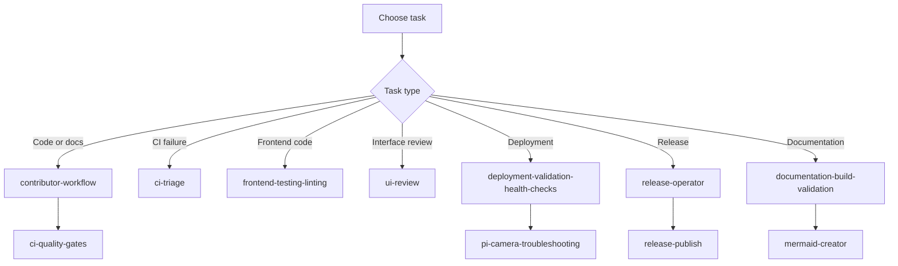

# Repository skills

These skills are short, task-specific playbooks for contributors and operators. Choose one by the work you need to do, then verify its guidance against the linked source files when those files change.

## Find a skill

| Task | Skill |
| --- | --- |
| Start a code or documentation change | [`contributor-workflow`](./contributor-workflow/SKILL.md) |
| Reproduce local quality gates | [`ci-quality-gates`](./ci-quality-gates/SKILL.md) |
| Diagnose a failed Actions job | [`ci-triage`](./ci-triage/SKILL.md) |
| Validate JavaScript or TypeScript changes | [`frontend-testing-linting`](./frontend-testing-linting/SKILL.md) |
| Review a web interface change | [`ui-review`](./ui-review/SKILL.md) |
| Apply the project’s interface design principles | [`front-end-design`](./front-end-design/SKILL.md) |
| Change or diagnose the mock camera flag | [`feature-flag-management`](./feature-flag-management/SKILL.md) |
| Review dependency update pull requests | [`dependabot-dependency-management`](./dependabot-dependency-management/SKILL.md) |
| Validate a deployment | [`deployment-validation-health-checks`](./deployment-validation-health-checks/SKILL.md) |
| Diagnose Raspberry Pi camera startup or streaming | [`pi-camera-troubleshooting`](./pi-camera-troubleshooting/SKILL.md) |
| Build or validate documentation | [`documentation-build-validation`](./documentation-build-validation/SKILL.md) |
| Create or update a Mermaid diagram | [`mermaid-creator`](./mermaid-creator/SKILL.md) |
| Understand scheduled formatting pull requests | [`nightly-autofix-workflow`](./nightly-autofix-workflow/SKILL.md) |
| Prepare a release | [`release-operator`](./release-operator/SKILL.md) |
| Verify published release artifacts | [`release-publish`](./release-publish/SKILL.md) |

## Contributor flow



## Skill authoring and maintenance

Use [`_template/SKILL.md`](./_template/SKILL.md) for new skills. Each `SKILL.md` must include the required frontmatter and sections in the template. Keep instructions concise, use exact current paths and commands, and link to repository sources that define the behavior.

There is no separate skill review workflow or owner registry. Review a skill when its source files or the referenced process changes, and update `last-reviewed` when you verify or revise its content.

The regression checks in [`tests/test_skills_documentation.py`](../../tests/test_skills_documentation.py) verify required skill structure, local links, referenced Make/npm commands, and Mermaid extraction and validation. Run them with:

```bash
python -m pytest tests/test_skills_documentation.py -q
```

## Repository sources

- [`AGENTS.md`](../../AGENTS.md) — Repository architecture and contributor instructions for coding agents.
- [`CONTRIBUTING.md`](../../CONTRIBUTING.md) — Human contribution process.
- [`.github/workflows/`](../workflows/) — CI, security scanning, release, and scheduled automation definitions.
- [`docs/CHANGELOG.md`](../../docs/CHANGELOG.md) — Version history and release notes.
- [`docs/guides/RELEASE.md`](../../docs/guides/RELEASE.md) — Release procedure and recovery guidance.
