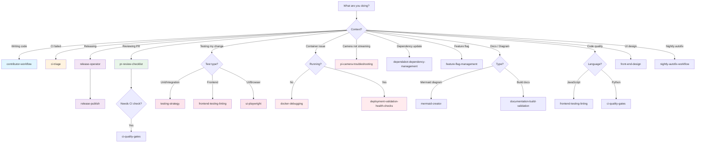

# Project Skills Index

This directory contains reusable execution playbooks for common motion-in-ocean tasks.

**New here?** Jump to [Quick Start by Role](#quick-start-by-role) to find the right skill for your workflow.

---

## Quick Start by Role

Find skills aligned with your primary workflow:

### **👨‍💻 Code Contributor**
Contributing code changes, bug fixes, or features?

1. Start: [`contributor-workflow`](./contributor-workflow/SKILL.md) — Plan & validate your change end-to-end
2. If CI fails: [`ci-triage`](./ci-triage/SKILL.md) — Diagnose and fix failures locally
3. Quality checks: [`frontend-testing-linting`](./frontend-testing-linting/SKILL.md) (if JS/TS changes) or [`ci-quality-gates`](./ci-quality-gates/SKILL.md) (if Python changes)
4. Tests needed: [`testing-strategy`](./testing-strategy/SKILL.md) (coming soon) — Decide test approach

### **🔍 Code Reviewer / Maintainer**
Reviewing pull requests or managing releases?

1. Review checklist: [`pr-review-checklist`](./pr-review-checklist/SKILL.md) (coming soon) — Structured PR review
2. Code quality: [`ci-quality-gates`](./ci-quality-gates/SKILL.md) — Validate CI gates before approval
3. Releases: [`release-operator`](./release-operator/SKILL.md) → [`release-publish`](./release-publish/SKILL.md)
4. Dependencies: [`dependabot-dependency-management`](./dependabot-dependency-management/SKILL.md) — Review & merge updates

### **🚀 DevOps / Operator**
Deploying, scaling, or troubleshooting production instances?

1. Pre-deployment: [`deployment-validation-health-checks`](./deployment-validation-health-checks/SKILL.md) — Verify container health
2. Camera not streaming: [`pi-camera-troubleshooting`](./pi-camera-troubleshooting/SKILL.md) — Diagnose Picamera2 issues
3. Container won't start: [`docker-debugging`](./docker-debugging/SKILL.md) (coming soon) — Debug container startup
4. Monitoring: Check `/health`, `/ready`, `/metrics` endpoints (see [deployment docs](../../docs/guides/DEPLOYMENT.md))

### **🎨 UI / Frontend Developer**
Building or testing web interfaces?

1. UI testing: [`ui-playwright`](./ui-playwright/SKILL.md) — Audit streaming viewer & management dashboard
2. Frontend quality: [`frontend-testing-linting`](./frontend-testing-linting/SKILL.md) — Run tests, ESLint, Prettier
3. Design & layout: [`front-end-design`](./front-end-design/SKILL.md) — Restrained, purposeful UI composition
4. Feature flags: [`feature-flag-management`](./feature-flag-management/SKILL.md) — Gate experimental UI features

### **📚 Documentation / Content**
Writing guides, architecture docs, or examples?

1. Diagrams & flows: [`mermaid-creator`](./mermaid-creator/SKILL.md) — Create semantic Mermaid diagrams
2. Building docs: [`documentation-build-validation`](./documentation-build-validation/SKILL.md) — Sphinx, JSDoc, Mermaid validation
3. Feature doc: Reference [AGENTS.md](../../AGENTS.md) (architecture guide) or [README.md](../../README.md) (quick start)

---

## Decision Flowchart

---

## Skills by Category

### CI/CD

| Skill | Purpose | Use When | Last Reviewed |
| ------- | --------- | ----------- | --------------- |
| [`ci-quality-gates`](./ci-quality-gates/SKILL.md) | Reproduce and evaluate CI/security gates locally before pushing changes. | Validating PR or debugging local CI parity | 2026-08-05 |
| [`ci-triage`](./ci-triage/SKILL.md) | Diagnose CI job failures with playbooks for test, lint, type-check, security, and scan jobs. | GitHub Actions job fails; need root cause | 2026-08-05 |
| [`release-operator`](./release-operator/SKILL.md) | Execute tag-driven releases with preflight checks, verification, and rollback awareness. | Creating a new semantic version release | 2026-08-05 |
| [`release-publish`](./release-publish/SKILL.md) | Run and verify Docker/GitHub Release publication via `.github/workflows/docker-publish.yml`. | Publishing images to GHCR after tag | 2026-08-05 |
| [`nightly-autofix-workflow`](./nightly-autofix-workflow/SKILL.md) | Monitor and troubleshoot scheduled nightly code quality automation (ESLint, Ruff, Prettier). | Nightly autofix PR fails or won't merge | 2026-08-05 |
| [`dependabot-dependency-management`](./dependabot-dependency-management/SKILL.md) | Review, test, and merge Dependabot PRs for Python and JavaScript/TypeScript dependencies. | Dependabot security/version update arrives | 2026-08-05 |

### Development

| Skill | Purpose | Use When | Last Reviewed |
| ------- | --------- | ----------- | --------------- |
| [`contributor-workflow`](./contributor-workflow/SKILL.md) | Plan, implement, and validate code/docs changes with quality gate validation. | Starting a new code change or PR | 2026-08-05 |
| [`frontend-testing-linting`](./frontend-testing-linting/SKILL.md) | Run Node.js tests, ESLint, and Prettier for JavaScript/TypeScript; includes fallow integration for code health assessment. | JS/TS changes need validation | 2026-08-05 |
| [`feature-flag-management`](./feature-flag-management/SKILL.md) | Enable, disable, and test feature flags; understand flag lifecycle for development and production. | Testing behind a feature gate | 2026-08-05 |

### Deployment

| Skill | Purpose | Use When | Last Reviewed |
| ------- | --------- | --------- | --------------- |
| [`pi-camera-troubleshooting`](./pi-camera-troubleshooting/SKILL.md) | Diagnose camera startup, streaming, device mapping, and health check failures. | Camera not detected or stream unavailable | 2026-08-05 |
| [`deployment-validation-health-checks`](./deployment-validation-health-checks/SKILL.md) | Validate post-deployment container health, device mapping, and API endpoint availability. | Post-deployment verification needed | 2026-08-05 |

### Design

| Skill | Purpose | Use When | Last Reviewed |
| ------- | --------- | --------- | --------------- |
| [`ui-playwright`](./ui-playwright/SKILL.md) | Audit motion-in-ocean web UI (streaming viewer, node management) with Playwright. | UI changes need comprehensive testing | 2026-08-05 |
| [`front-end-design`](./front-end-design/SKILL.md) | Create visually strong UIs with restrained composition, image-led hierarchy, and tasteful motion. | Designing landing page, interface, or prototype | 2026-08-05 |

### Documentation

| Skill | Purpose | Use When | Last Reviewed |
| ------- | --------- | --------- | --------------- |
| [`mermaid-creator`](./mermaid-creator/SKILL.md) | Create clear, semantically meaningful Mermaid diagrams for architecture, workflows, and PRDs. | Creating architecture, state, or workflow diagram | 2026-08-05 |
| [`documentation-build-validation`](./documentation-build-validation/SKILL.md) | Build, validate, and troubleshoot Sphinx documentation, JSDoc generation, and Mermaid diagrams. | Docs won't build or links are broken | 2026-08-05 |

---

## Coming Soon

The following skills are in development:

- **`docker-debugging`** — Debug container startup, networking, volumes, and stream failures
- **`testing-strategy`** — Decide test type and write unit, integration, or UI tests
- **`pr-review-checklist`** — Structured PR review checklist for maintainers

---

## Related Skills (Quick Navigation)

Below are connections between skills that often work together:

**Contributor workflow:**

- [`contributor-workflow`](./contributor-workflow/SKILL.md) → Before PR
  - [`ci-quality-gates`](./ci-quality-gates/SKILL.md) → Validate locally
  - [`frontend-testing-linting`](./frontend-testing-linting/SKILL.md) → If JS/TS changes
  - [`testing-strategy`](./testing-strategy/SKILL.md) (coming) → If tests needed
  - [`pr-review-checklist`](./pr-review-checklist/SKILL.md) (coming) → After review feedback

**Release workflow:**

- [`release-operator`](./release-operator/SKILL.md) → Create release
  - [`release-publish`](./release-publish/SKILL.md) → Publish to GHCR
  - [`ci-triage`](./ci-triage/SKILL.md) → If workflow fails

**Troubleshooting:**

- [`ci-triage`](./ci-triage/SKILL.md) ← CI failed
  - [`ci-quality-gates`](./ci-quality-gates/SKILL.md) ← Reproduce locally
  - [`docker-debugging`](./docker-debugging/SKILL.md) (coming) ← Container issue
  - [`pi-camera-troubleshooting`](./pi-camera-troubleshooting/SKILL.md) ← Camera issue
  - [`deployment-validation-health-checks`](./deployment-validation-health-checks/SKILL.md) ← Health check failed

---

## Skill authoring template

Use [`_template/SKILL.md`](./_template/SKILL.md) when creating or updating a skill.

## Maintenance policy

### Required metadata (frontmatter)

Every skill must include these metadata fields:

- `name` (required)
- `description` (required)
- `owner` (required)
- `last-reviewed` (required, ISO date format `YYYY-MM-DD`)
- `category` (required; one of: CI/CD, Development, Deployment, Documentation, Design, Tools)
- `compatible-repo-areas` (required, list of paths/components the skill applies to)

### Required content sections

Every skill must include all of the following sections:

- `## Purpose`
- `## Scope and trigger conditions`
- `## Required inputs`
- `## Step-by-step workflow`
- `## Validation checklist`
- `## Source of truth`
- `## Common failure modes and recovery actions`
- `## Maintenance notes`
- `## Related Skills` (new; list prerequisite and complementary skills)

The `## Source of truth` section is mandatory and must reference specific repository files (not generic statements). At minimum, include:

- `.github/workflows/*.yml`
- `README.md`
- `CONTRIBUTING.md`

Add additional files as needed for the skill domain (for example `RELEASE.md`, `CHANGELOG.md`, deployment config, or service-specific docs).

The `## Related Skills` section should list:

- **Prerequisites:** Skills that should be completed first (e.g., `contributor-workflow` before `ci-quality-gates`)
- **Complements:** Skills that work well together (e.g., `release-operator` and `release-publish`)
- **See also:** Alternative or advanced skills in the same domain

### Review cadence and automation

**Quarterly reviews:**

- Every skill is reviewed at least once per quarter for accuracy and freshness
- Owners are notified via GitHub issue (see `.github/ISSUE_TEMPLATE/skill-review.md`)
- On review, update the `last-reviewed` field to the current date

**Immediate reviews (change triggers):**

When any of the following change, affected skills must be reviewed and updated within one week:

- CI/release/automation workflow files under `.github/workflows/`
- Release process definitions (for example `RELEASE.md`, versioning, tagging, or publish mechanics)
- Configuration or environment behavior (new/changed env vars, runtime defaults, deployment settings)
- Contributor process documentation (`README.md`, `CONTRIBUTING.md`, quality gates, or PR expectations)

**Automation & monitoring:**

- GitHub Actions workflow validates skill syntax and structure on PR (see `.github/workflows/skill-validate.yml`)
- SKILL_OWNERS.md registry enables CODEOWNERS routing for skill review assignments
- Stale skill detection (>180 days without review) is flagged in quarterly maintainer reviews

---

## Source references used

- `README.md` for quick start, local development, and CI/CD expectations.
- `CONTRIBUTING.md` for contributor workflow and validation commands.
- `.github/workflows/*.yml` for exact CI and release automation behavior.
- `CHANGELOG.md` for release note structure and version history conventions.
- `RELEASE.md` for tag-driven release process and rollback mechanics.
