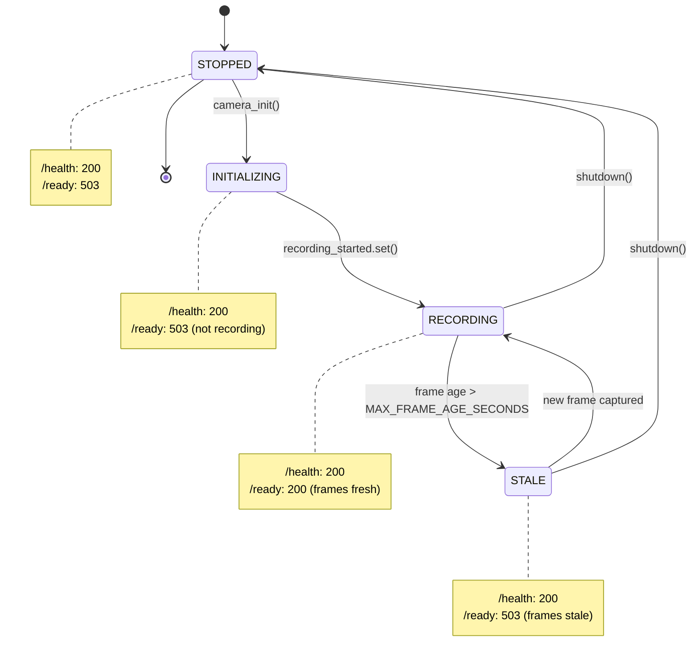
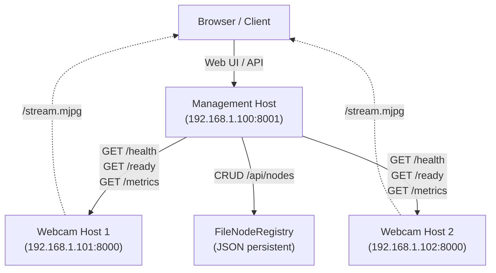
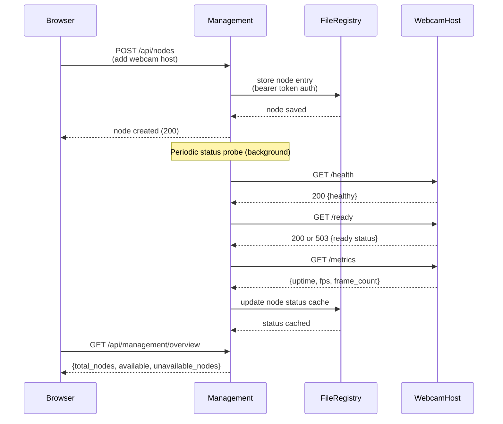
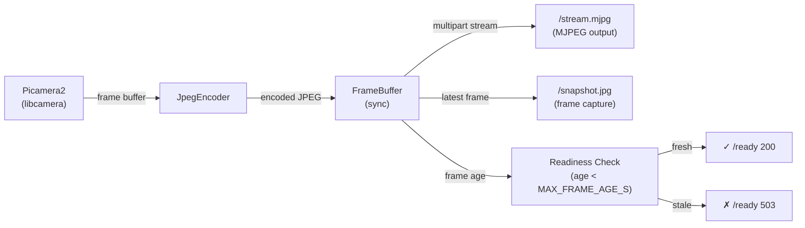

# Skill: Mermaid Diagram Creator for motion-in-ocean

## Purpose

Create Mermaid diagrams that clarify camera streaming architecture, health/readiness state transitions, API workflows, frame capture pipelines, and deployment scenarios. Diagrams serve both developers (architecture understanding, state machines, data flows) and operators (deployment clarity, troubleshooting visual reference).

---

## Inputs / Outputs / Non-goals

- **Inputs:** PRD sections, state transition descriptions, multi-host workflows, API specifications, architecture constraints.
- **Outputs:** Valid Mermaid diagrams aligned with project semantics (health/readiness, frame staleness, node registry, Picamera2 pipeline).
- **Non-goals:** Decorative diagrams that misrepresent architecture; diagrams that diverge from PRD terminology; overly detailed flowcharts that obscure intent.

---

## Trigger Conditions

Use this skill when:

- Creating or updating diagrams in [PRD-backend.md](../../PRD-backend.md), [PRD-frontend.md](../../PRD-frontend.md), [DEPLOYMENT.md](../../DEPLOYMENT.md), or [README.md](../../README.md).
- Translating plain-language requirements into Mermaid syntax (e.g., "readiness depends on camera recording AND frames not stale").
- Refactoring ASCII art diagrams into semantic Mermaid structures (e.g., DEPLOYMENT.md ASCII architecture).
- Documenting state machines (`/health` Always 200 vs `/ready` conditional availability).
- Visualizing API workflows (node CRUD, status probing, aggregation).
- Illustrating frame capture pipelines (Picamera2 → JpegEncoder → FrameBuffer → stream/snapshot).

---

## Mandatory Rules

1. **Match diagram type to intent:**
   - **Health/Readiness lifecycle:** `stateDiagram-v2` (state machine)
   - **Architecture/multi-host deployment:** `graph TD` (flowchart, top-down)
   - **API workflows / node registry CRUD:** `sequenceDiagram` (multi-actor interactions)
   - **Frame capture pipeline:** `graph LR` (data flow, left-to-right)
   - **Data models / relationships:** `erDiagram` (entity relationship, if needed)

2. **Keep labels explicit, domain-accurate, deterministic:**
   - Terminology must match [PRD-backend.md](../../PRD-backend.md), [PRD-frontend.md](../../PRD-frontend.md), codebase.
   - Examples of accurate labels: `RECORDING`, `STALE`, `recording_started`, `MAX_FRAME_AGE_SECONDS`, `Bearer Token Auth`, `/ready`, `FileNodeRegistry`.
   - Avoid ambiguous labels like "Check" or "Ready?" — be explicit: "Frames fresh?" with yes/no branches.

3. **Split oversized diagrams:**
   - If a single diagram exceeds ~15 nodes or 20 transitions, split into separate diagrams (e.g., overarching architecture + detailed state machine).
   - Example: "Multi-Node Architecture" (7 nodes) separate from "Node Registry Lifecycle" (10 nodes).

4. **Use stable node IDs and validate syntax:**
   - Node IDs should be deterministic (no random suffixes or timestamps).
   - Test each diagram at [mermaid.live](https://mermaid.live) before committing.
   - Verify Markdown rendering on GitHub (web + mobile).

5. **Keep styling secondary to semantic clarity:**
   - Use Mermaid's default styling; avoid excessive color/custom CSS unless critical for understanding.
   - Use notes/comments in diagrams to clarify less obvious transitions (e.g., "MAX_FRAME_AGE_SECONDS threshold triggers staleness").

---

## Context: motion-in-ocean Terminology

### Key Concepts

- **`RECORDING` state:** Camera has initialized and is capturing frames; `recording_started` event was set.
- **`STALE` frames:** Latest frame age exceeds `MAX_FRAME_AGE_SECONDS` (PRD default: 10 seconds).
- **`/health` endpoint:** Always returns HTTP 200 (liveness probe); used by Docker healthcheck.
- **`/ready` endpoint:** Returns 200 only if camera is in `RECORDING` state AND frames are not `STALE`; else returns 503 (readiness probe).
- **`/stream.mjpg`:** MJPEG multipart stream; returns 503 if not ready.
- **Frame buffer lifecycle:** Picamera2 captures → JpegEncoder processes → FrameBuffer stores for sync access → MJPEG stream and snapshot endpoint.
- **Bearer Token Auth:** Modern auth for node registry; legacy auth uses basic username/password (see `migrate_node_registry_auth.py`).
- **FileNodeRegistry:** Persistent node storage (JSON file); CRUD endpoint at `/api/nodes`.
- **Management mode:** Hub-and-spoke architecture; management host probes remote webcam hosts via HTTP, aggregates status.
- **Webcam mode:** Runs on camera host; exposes `/stream.mjpg`, `/health`, `/ready`, `/metrics`.

### Relationship Terminology

- **HTTP probe:** Management host sends GET to remote `/health`, `/ready`, or `/metrics` endpoint.
- **Status aggregation:** Management consolidates node responses into `/api/management/overview` summary.
- **Transport types:** `http` (default), `docker` (Docker socket proxy, advanced).
- **Node unreachable:** HTTP probe fails (timeout, connection refused, etc.); returned as node status.

---

## Diagram Examples (motion-in-ocean Specific)

### Example 1: Health/Readiness State Machine

**Use when:** Explaining the behavior of `/health` vs `/ready` and frame staleness logic.



**Rationale:** State machine clarifies that `/health` is always 200 (liveness), while `/ready` transitions between 200 and 503 based on recording state and frame freshness. Helps operators understand why `/ready` might return 503 even when `/health` is 200.

---

### Example 2: Multi-Node Architecture (HTTP-Based)

**Use when:** Explaining the hub-and-spoke deployment model across multiple hosts.



**Rationale:** Shows hub-and-spoke topology with HTTP probes flowing from management to webcam hosts, and persistent node storage. Solid lines represent control/probe traffic; dotted lines represent optional direct streaming paths.

---

### Example 3: Node Registry CRUD & Status Workflow

**Use when:** Documenting the `/api/nodes` CRUD lifecycle and status aggregation flow.



**Rationale:** Sequence diagram clarifies the asynchronous relationship between node CRUD operations and periodic status polling. Helps integrators understand that node creation is synchronous but status aggregation is continuous/background.

---

### Example 4: Frame Capture Pipeline

**Use when:** Explaining how Picamera2 frames flow through the system to endpoints.



**Rationale:** Linear data flow shows how Picamera2 capture feeds through encoding and buffering to both real-time streaming and frame freshness checks. Clarifies that the same FrameBuffer powers the MJPEG stream, snapshot endpoint, and readiness probe logic.

---

## Validation Checklist

Before committing a diagram:

- [ ] Diagram parses as valid Mermaid syntax (no errors at [mermaid.live](https://mermaid.live)).
- [ ] Node labels and terms match [PRD-backend.md](../../PRD-backend.md), [PRD-frontend.md](../../PRD-frontend.md), [DEPLOYMENT.md](../../DEPLOYMENT.md), or codebase terminology.
- [ ] Scope and assumptions are explicitly documented in the diagram (notes, caption, or surrounding markdown).
- [ ] Markdown renders correctly on GitHub (web and mobile views).
- [ ] Diagram does not exceed ~15 nodes; if larger, consider splitting into multiple diagrams.
- [ ] No ambiguous labels (e.g., "Check" should be "Check frame freshness").
- [ ] Diagram supports understanding for both developers and operators (cross-domain clarity).

---

## Expected Output Format

### Markdown Placement

Diagrams are embedded directly in existing markdown files (`PRD-backend.md`, `DEPLOYMENT.md`, `README.md`) where they clarify concepts, replacing or augmenting existing text descriptions.

### Mermaid Block Structure

````markdown
## Section Heading

Introductory paragraph explaining the concept or workflow this section addresses.

```mermaid
<diagram-type>
    <nodes-and-relationships>
```
````

**Figure {N}: {Descriptive Caption}**

Rationale (2–4 lines):

- What diagram type was chosen and why.
- Key insight or transition logic the diagram clarifies.
- Assumptions or future extensions (if applicable).

Example response / additional context:

- Link to related sections in PRDs.
- Reference implementation in codebase.

````

---

## Failure / Stop Conditions

1. **Stop if requirements are too ambiguous to model faithfully:**
   - Example: Cannot diagram a workflow without knowing the exact sequence of state transitions.
   - **Resolution:** Return to PRD authors/SMEs for clarification before attempting diagram.

2. **Stop if diagram semantics conflict with PRD terminology:**
   - Example: PRD says state is `RECORDING` but diagram shows `ACTIVE` or `RUNNING`.
   - **Resolution:** Revise diagram to use exact terminology from source text.

3. **Stop if Mermaid syntax limitations prevent accurate modeling:**
   - Example: Complex conditional logic too intricate for standard flowchart.
   - **Resolution:** Split into multiple diagrams or augment with detailed text description.

4. **Stop if diagram would exceed 20 nodes/transitions:**
   - **Resolution:** Split into focused sub-diagrams with cross-references.

---

## Workflow: Creating a Diagram

1. **Identify trigger:** Which concept, workflow, or state machine in the PRD needs visualization?
2. **Choose diagram type:** Refer to mandatory rules section (state machine vs. flowchart vs. sequence vs. data flow).
3. **Extract terminology:** Copy exact labels from PRDs and codebase (e.g., `/ready`, `MAX_FRAME_AGE_SECONDS`, `recording_started`).
4. **Draft nodes/edges:** Build the diagram structure; validate syntax at [mermaid.live](https://mermaid.live).
5. **Test rendering:** Paste into GitHub markdown preview; verify on mobile.
6. **Write rationale:** 2–4 sentence explanation of diagram type choice and key insights.
7. **Place in markdown:** Insert into appropriate section with caption and surrounding context.
8. **Validation:** Walk through checklist above before committing.

---

## Example PRD Section with Integrated Diagram

From [PRD-backend.md](../../PRD-backend.md) section "Health & Readiness Probes (P1)":

---

### 2. Health & Readiness Probes (P1)

**Endpoints:**

- `GET /health` → Always returns 200 with `{ status: "healthy" }` and timestamp.
- `GET /ready` → Returns 200 when the camera has started recording **and** the latest frame age is within the configured threshold; otherwise returns 503 with reason and diagnostic fields.

**Readiness details:**

- Must indicate `not_ready` status when:
  - Camera recording is not started.
  - No frames have been captured yet.
  - Latest frame age exceeds `MAX_FRAME_AGE_SECONDS`.

**State transitions:**

```mermaid
stateDiagram-v2
    [*] --> STOPPED
    STOPPED --> INITIALIZING: camera_init()
    INITIALIZING --> RECORDING: recording_started.set()
    RECORDING --> STALE: frame age > MAX_FRAME_AGE_SECONDS
    STALE --> RECORDING: new frame captured
    RECORDING --> STOPPED: shutdown()
    STALE --> STOPPED: shutdown()
    STOPPED --> [*]

    note right of STOPPED
        /health: 200 ✓
        /ready: 503 (not ready)
    end note

    note right of INITIALIZING
        /health: 200 ✓
        /ready: 503 (not recording)
    end note

    note right of RECORDING
        /health: 200 ✓
        /ready: 200 ✓ (frames fresh)
    end note

    note right of STALE
        /health: 200 ✓
        /ready: 503 (frames stale)
    end note
````

**Figure 1: Health and Readiness State Transitions**

The state machine clarifies that `/health` is a liveness probe (always 200) while `/ready` is a readiness probe that transitions between 200 and 503 based on camera recording state and frame freshness (MAX_FRAME_AGE_SECONDS threshold). Operators can use this to understand why `/ready` might return 503 even when the service is healthy, indicating transient unavailability (e.g., camera initializing or frames stale due to network delays).

---

## Related Documentation

- [PRD-backend.md](../../PRD-backend.md) — Backend requirements, health/readiness specs.
- [PRD-frontend.md](../../PRD-frontend.md) — Frontend requirements, UI resilience and retry logic.
- [DEPLOYMENT.md](../../DEPLOYMENT.md) — Multi-host architecture, HTTP scenarios.
- [README.md](../../README.md) — Quick start, architecture overview, architecture & key concepts.
- [CONTRIBUTING.md](../../CONTRIBUTING.md) — Contribution guidelines, documentation standards.

---

## Tool & Resources

- **Mermaid Live Editor:** [mermaid.live](https://mermaid.live) (for syntax validation and quick testing)
- **Mermaid Documentation:** [mermaid.js.org](https://mermaid.js.org)
- **GitHub Mermaid Support:** [GitHub Markdown Mermaid Support](https://docs.github.com/en/get-started/writing-on-github/working-with-advanced-formatting/creating-diagrams)
