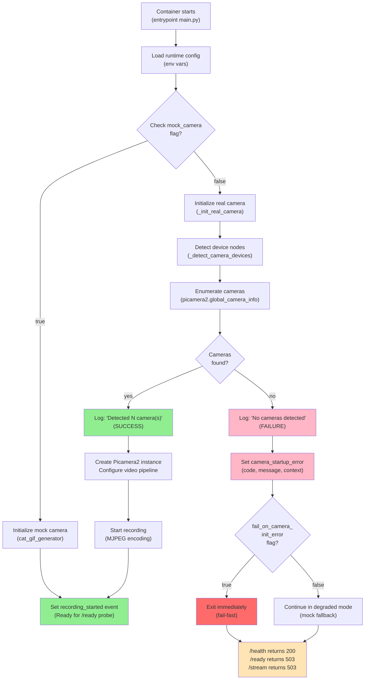

## Scope and trigger conditions

Use this skill when:

- The container starts but camera streaming fails.
- `/stream.mjpg`, `/health`, or `/ready` return unexpected responses.
- Device mapping or host camera detection is uncertain.
- You are developing on non-Pi hardware and need expected mock-mode behavior.

## Fast triage inputs

Collect these before branching deeper:

```bash
docker compose ps
docker compose logs --tail=200 motion-in-ocean
curl -sS -i http://localhost:8000/health
curl -sS -i http://localhost:8000/ready
curl -sS -i http://localhost:8000/stream.mjpg
```

Good signals:

- Container is `Up` and health status is healthy.
- `/health` returns HTTP `200` with `{"status":"healthy", ...}`.
- `/ready` returns HTTP `200` with `"status":"ready"`.
- `/stream.mjpg` returns HTTP `200` and `Content-Type: multipart/x-mixed-replace`.

Bad signals:

- Container restarting/crashed.
- `/health` non-200 or timeout.
- `/ready` HTTP `503` with reasons like camera not initialized, no frames, or stale stream.
- `/stream.mjpg` HTTP `503` (`Camera stream not ready.`) or `429` (connection limit reached).

## Runtime configuration checklist (README-backed)

Validate runtime env configuration first:

```bash
docker compose config
```

Focus on these variables:

- `MOTION_IN_OCEAN_RESOLUTION` (e.g. `640x480`)
- `MOTION_IN_OCEAN_FPS`
- `MOTION_IN_OCEAN_TARGET_FPS`
- `MOTION_IN_OCEAN_JPEG_QUALITY`
- `MOTION_IN_OCEAN_MAX_STREAM_CONNECTIONS`
- `MOTION_IN_OCEAN_PI3_PROFILE`
- `MOTION_IN_OCEAN_HEALTHCHECK_READY`
- `MOCK_CAMERA`

Expected behavior:

- Healthcheck defaults to `/health`.
- If `MOTION_IN_OCEAN_HEALTHCHECK_READY=true`, healthcheck uses readiness semantics (`/ready`).
- If `MOCK_CAMERA=true`, Picamera2 init is skipped and dummy frames are produced (useful off-Pi).

## Device Node Reference (libcamera Requirements)

Raspberry Pi camera access via libcamera requires specific device nodes, each with distinct role:

| Device             | Purpose                                                                | Required? | Typical Permissions       |
| ------------------ | ---------------------------------------------------------------------- | --------- | ------------------------- |
| `/dev/dma_heap/*`  | Memory allocation for video buffers (ISP, codec)                       | ✓ Yes     | Character device (253:\*) |
| `/dev/vchiq`       | VideoCore Host Interface for camera control and power management       | ✓ Yes     | Character device (511:\*) |
| `/dev/video*`      | V4L2 video capture nodes (ISP output, codec output)                    | ✓ Yes     | Character device (81:\*)  |
| `/dev/media*`      | Media controller API for sensor/pipeline control (libcamera discovery) | ✓ Yes     | Character device (250:\*) |
| `/dev/v4l-subdev*` | V4L2 sub-device interface for sensor and processing chains             | ✓ Yes     | Character device (81:\*)  |
| `/dev/dri/`        | GPU/graphics rendering (optional, for pykms mock support)              | ✗ No      | Various character devices |

**In containers:**

- If using `privileged: true`: All devices are automatically exposed
- If using hardened mode (recommended for production): Explicitly map detected devices using `detect-devices.sh` output

---

## Device Detection & Mapping (detect-devices.sh Workflow)

### Why Device Mapping Matters

When container cannot enumerate cameras, the root cause is typically **missing device nodes in container namespace**. The `detect-devices.sh` script safely discovers which devices exist on your Raspberry Pi host and generates mappings.

### Host Detection (Raspberry Pi)

**On your Raspberry Pi host (outside Docker):**

```bash
# 1. Run detection script from project root
./scripts/detect-devices.sh

# Expected output:
# [INFO] /dev/dma_heap/system - DMA memory
# [INFO] /dev/vchiq - VideoCore Host Interface
# [INFO] /dev/media0
# [INFO] /dev/video0
# [INFO] /dev/v4l-subdev0
# [INFO] rpicam-hello --list-cameras works (✓ success)
```

**If any devices are missing:**

1. **Ensure camera is enabled:**

   ```bash
   raspi-config nonint get_camera
   # Returns 0 if enabled, 1 if disabled
   sudo raspi-config nonint do_camera 0  # Enable
   sudo reboot
   ```

2. **Verify camera hardware:**
   - Check CSI cable seating and orientation
   - Test with: `rpicam-hello --list-cameras` (should list at least one camera)

3. **If `/dev/vchiq` or `/dev/dma_heap` missing:**
   - Indicates kernel/firmware issue
   - Update kernel: `sudo apt update && sudo apt upgrade && sudo reboot`

### Generate Docker Compose Device Mappings

**After verifying host devices, generate docker-compose.override.yaml:**

```bash
# Generate override file with detected devices
./scripts/detect-devices.sh containers/motion-in-ocean-webcam/

# Creates: containers/motion-in-ocean-webcam/docker-compose.override.yaml
```

**Start container with detected mappings:**

```bash
cd containers/motion-in-ocean-webcam/

# Using default (privileged mode):
docker compose up -d

# Using hardened mode (explicit device access):
docker compose -f docker-compose.yml -f docker-compose.hardened.yml up -d

# Using generated override (recommended):
docker compose -f docker-compose.yml -f docker-compose.override.yaml up -d
```

### Validate Container Device Access

**After container starts:**

```bash
# Check that devices are mounted in container
docker exec motion-in-ocean ls -la /dev/dma_heap /dev/vchiq /dev/video* /dev/media* 2>/dev/null

# Expected output: device nodes should be accessible
# If any are missing: device mapping did not transfer correctly
```

### Compose Configuration Verification

```bash
# View resolved compose config (merged from all -f files)
docker compose config | sed -n '/devices:/,/group_add:/p'
```

Good signals:

- `devices:` lists absolute host paths matching detected nodes (e.g., `/dev/video0:/dev/video0`)
- `/run/udev:/run/udev:ro` is mounted (udev rules propagated into container)
- `group_add: [video, render]` is present for group-based permissions

Bad signals:

- Stale/hardcoded device entries that do not exist on host
- Missing udev mount
- No group assignments

## Health/readiness diagnostics

### Endpoint semantics

- `/health`: liveness only; should be `200` when Flask service is running.
- `/ready`: readiness; returns `200` only when recording started and frame age is fresh.
- `/stream.mjpg`: returns `503` when recording has not started; `429` when max stream clients is exceeded.

### Commands

```bash
curl -sS -i http://localhost:8000/health
curl -sS -i http://localhost:8000/ready
curl -sS http://localhost:8000/ready | jq .
docker exec motion-in-ocean python3 /app/healthcheck.py; echo $?
```

Good signals:

- `/health` => `200`.
- `/ready` => `200` and includes readiness payload with recent `last_frame_age_seconds`.
- `healthcheck.py` exits `0`.

Bad signals:

- `/ready` => `503` + reason:
  - `Camera not initialized or recording not started`
  - `No frames captured yet`
  - `stale_stream`
- `healthcheck.py` exits non-zero.

If using readiness-based healthcheck:

```bash
docker exec motion-in-ocean env | grep -E 'HEALTHCHECK|MOTION_IN_OCEAN_HEALTHCHECK_READY'
```

Good: `MOTION_IN_OCEAN_HEALTHCHECK_READY=true` (or `HEALTHCHECK_READY=true`) matches expected policy.

---

## Container Startup Flow Diagram

This diagram shows the initialization sequence and where camera detection failures occur:



**Key decision points:**

1. **Mock camera enabled?** (`MOCK_CAMERA` or `MIO_CAT_GIF` env vars)
   - If yes: Dummy frame generation; always succeeds
   - If no: Proceed to real camera initialization

2. **Device nodes detected?** (`_detect_camera_devices()`)
   - If no: Log device inventory and fail category

3. **Cameras enumerated by libcamera?** (`picamera2.global_camera_info()`)
   - If no: Log error, set camera startup error with context, branch to fail-fast or degraded mode

4. **Fail-fast enabled?** (`MIO_FAIL_ON_CAMERA_INIT_ERROR=true`)
   - If yes: Container exits; clear indication of infrastructure problem
   - If no: Container stays running but `/ready` returns 503; can probe and debug via API

---

## Error Message Index

Cross-reference specific error messages logged or returned to root causes and remediation:

| Error Message                                                        | Where                    | Root Cause                                                                            | Troubleshooting Branch                                                     |
| -------------------------------------------------------------------- | ------------------------ | ------------------------------------------------------------------------------------- | -------------------------------------------------------------------------- |
| `No cameras detected by picamera2 enumeration`                       | `main.py:1553` (logs)    | Device nodes exist but libcamera enumeration failed                                   | Device mapping + libcamera pipeline (see below)                            |
| `No cameras detected. Check device mappings and camera hardware.`    | `/ready` response (503)  | Same; returned when `/ready` is probed during degraded mode                           | Device mapping verification; if devices OK, check libcamera/IPA            |
| `RuntimeError: No cameras detected...`                               | Container logs (startup) | Camera initialization failed completely                                               | Fail-fast branch (if MIO_FAIL_ON_CAMERA_INIT_ERROR=true)                   |
| `Camera enumeration failed. Verify device mappings and permissions.` | Container logs           | Picamera2 raised IndexError during camera detection                                   | Run `./detect-devices.sh`; verify container device mappings                |
| `Permission denied accessing camera device`                          | Container logs           | Camera device nodes mounted but container lacks read/execute permission               | Add group_add: [video, render]; verify stat permissions match /dev/video\* |
| `Camera not initialized or recording not started`                    | `/ready` response (503)  | \_init_real_camera() did not complete successfully or recording_started event not set | Check container logs for specific error; probe /health                     |
| `No frames captured yet`                                             | `/ready` response (503)  | Recording started but frame buffer still empty                                        | Normal during startup; wait a few seconds and retry                        |
| `stale_stream`                                                       | `/ready` response (503)  | Last frame captured > max_frame_age_seconds ago (default 5s)                          | Check if camera is hung or FPS is too low for frame age threshold          |
| `HTTP 429 on /stream.mjpg`                                           | Stream response          | Max stream connections reached (default 5)                                            | Increase MOTION_IN_OCEAN_MAX_STREAM_CONNECTIONS or close existing clients  |

---

## Libcamera Pipeline Troubleshooting

Even if device nodes are correctly mapped, camera enumeration can fail if libcamera cannot load the camera pipeline or IPA modules for your hardware.

### Common libcamera/Pipeline Failures

**Symptom:** Device nodes exist (`/dev/video0`, `/dev/media0`, `/dev/vchiq` present in container) but picamera2.global_camera_info() returns empty list.

**Root Causes:**

1. **Pipeline or IPA modules missing** (corrupted/incomplete Dockerfile build)
2. **Incompatible Debian suite** (e.g., bookworm IPA incompatible with bullseye kernel)
3. **Missing Picamera2 system dependencies** (libcamera, libcamera-apps, roles package)

### Diagnosis

**Inside container, test libcamera directly:**

```bash
docker exec motion-in-ocean /bin/bash

# Find where libcamera libraries are installed
ldconfig -p | grep libcamera

# List available pipelines
ls /usr/lib/libcamera/ipa/ 2>/dev/null
# Normal output: /usr/lib/libcamera/ipa/libcamera_ipa_rpi.la, etc.

# Test libcamera enumeration (low-level)
libcamera-hello --list-cameras 2>&1 | tee /tmp/libcamera-test.log
```

**Expected output from libcamera-hello:**

```
Available cameras:
0: imx708 [4608x2592] (/base/soc/i2c0mux/i2c@0,0/imx708@1a)
```

**If no cameras listed, examine logs:**

```bash
LIBCAMERA_LOG_LEVELS=DEBUG libcamera-hello --list-cameras 2>&1 | head -30
```

Look for:

- `[ERROR]` messages about pipeline loading
- `[ERROR]` messages about IPA modules
- Missing `/usr/lib/libcamera/ipa/` directory entirely

### Dockerfile Build Args (Camera Stack Selection)

Camera support is controlled by Dockerfile build arguments. Check your image build:

```bash
# Inspect image build args (if available in history)
docker image inspect ghcr.io/cyanautomation/motioninocean:latest --format='{{json .Config.Labels}}' | jq '.[] | select(. | contains("DEBIAN_SUITE"))'
```

Key args affecting camera support:

- `DEBIAN_SUITE` (bullseye, bookworm) — OS baseline for libcamera/IPA versions
- `RPI_SUITE` (bullseye-rtkit, bookworm) — RPi camera stack version
- `ALLOW_BOOKWORM_FALLBACK` — If true, tries bookworm IPA when primary suite fails

**If image built with mismatched suites:**

```bash
# Rebuild image with correct suite
docker build \
  --build-arg DEBIAN_SUITE=bookworm \
  --build-arg RPI_SUITE=bookworm \
  -t motioninocean:bookworm \
  .

# Test new image
docker compose -f docker-compose.yml up -d
```

### Reference: Libcamera Component Versions

| Component          | Bullseye          | Bookworm          | Notes                          |
| ------------------ | ----------------- | ----------------- | ------------------------------ |
| libcamera          | 0.0.x             | 0.1.x+            | Different API/behavior         |
| libcamera-apps     | 0.7.x             | 1.1.x+            | OctoPrint compatibility varies |
| picamera2 (Python) | 0.3.x             | 0.6.x+            | Highly version-sensitive       |
| IPA modules        | bullseye-specific | bookworm-specific | NOT backward compatible        |

If running bullseye kernel with bookworm IPA (or vice versa), libcamera will fail silently during enumeration.

---

## Log Format & Structured Logging

1. **Camera not detected**
   - Run `./detect-devices.sh`.
   - If `/dev/media*` or `/dev/video*` missing:
     - Enable camera in `raspi-config`, reboot, verify hardware seating/cable, retest with `rpicam-hello --list-cameras`.
   - If host sees camera but container does not:
     - Update `docker-compose.yaml` `devices:` mappings to match detected nodes; keep `/run/udev` mount.

2. **Stream endpoint unavailable (`/stream.mjpg`)**
   - Check `/health` then `/ready`.
   - If `/health=200` and `/ready=503`:
     - Camera pipeline not ready; inspect logs for camera init/frame capture errors.
   - If `/stream.mjpg=429`:
     - Increase `MOTION_IN_OCEAN_MAX_STREAM_CONNECTIONS` or close existing clients.
   - If `/stream.mjpg=503`:
     - Readiness not achieved yet; resolve underlying camera startup/frame freshness issue.

3. **Health endpoint unhealthy**
   - If `/health` fails: service process issue (startup crash/bind failure).
   - Run `docker compose logs --tail=200 motion-in-ocean` and restart:

     ```bash
     docker compose restart motion-in-ocean
     ```

   - Validate container healthcheck mode:
     - Default should target `/health`.
     - If readiness mode enabled, temporary camera issues may mark container unhealthy by design.

4. **Non-Pi development environment**
   - Set mock mode:

     ```bash
     export MOCK_CAMERA=true
     docker compose up -d --force-recreate
     ```

   - Expected in mock mode:
     - `/health` returns `200`.
     - `/ready` should become `200` once mock frame generator starts.
     - `/stream.mjpg` should stream dummy frames.
   - If `MOCK_CAMERA=false` on non-Pi hosts, camera initialization failures are expected.

## Diagnostic bundle to attach in issues

```bash
uname -a
cat /etc/os-release
docker compose ps
docker compose logs --tail=300 motion-in-ocean
curl -sS -i http://localhost:8000/health
curl -sS -i http://localhost:8000/ready
```

On Raspberry Pi hosts also include:

```bash
./detect-devices.sh
rpicam-hello --list-cameras
```

Include compose snippets for `devices:`, `volumes:`, and relevant environment variables (`MOTION_IN_OCEAN_*`, `MOCK_CAMERA`).
