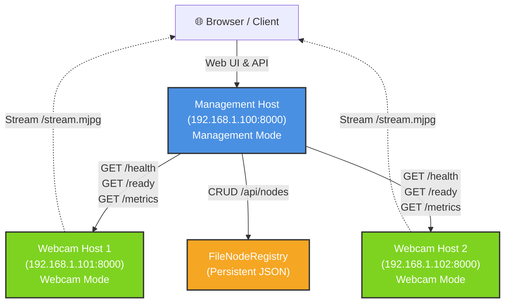

# Motion in Ocean - Deployment Guide

This guide covers deploying Motion in Ocean using the **recommended directory-based approach** as well as legacy single-file patterns. Directory-based deployments are tool-compatible (e.g., with Dockhand) and provide clear isolation between deployments.

> **February 2026 Update:** Motion in Ocean now supports both directory-based deployments (recommended) and legacy compose files. See [Recommended: Directory-Based Deployment](#recommended-directory-based-deployment) first, then [Legacy: Root-Level Compose Files](#legacy-root-level-compose-files) for migration guidance.

---

## Recommended: Directory-Based Deployment

Each deployment (webcam, management, etc.) lives in its own directory with a standard `docker-compose.yml` filename. This pattern is compatible with container orchestration tools and eliminates complexity from custom filenames and `-f` flags.

**Directory Structure:**

```
~/containers/
├── motioniocean-webcam/
│   ├── docker-compose.yml          # Main config
│   ├── docker-compose.hardened.yml # Security overlay (optional)
│   ├── docker-compose.mock.yml     # Mock camera (optional)
│   └── .env                        # Configuration
│
└── motioniocean-management/
    ├── docker-compose.yml          # Main config
    └── .env                        # Configuration
```

**Quick Start - Webcam Mode:**

```bash
cd ~/containers/motioniocean-webcam
docker compose up -d
```

**Quick Start - Management Mode:**

```bash
cd ~/containers/motioniocean-management
docker compose up -d
```

**Ports:**

- Webcam: Port 8000 (configurable via `.env`)
- Management: Port 8001 (configurable via `.env`)

**Advanced - Hardened Security:**

```bash
cd ~/containers/motioniocean-webcam
# Auto-detect camera devices on your Raspberry Pi
../../../detect-devices.sh .
# Start with hardened (non-privileged) mode
docker compose -f docker-compose.yml -f docker-compose.hardened.yml up -d
```

**Advanced - Mock Camera (Testing):**

```bash
cd ~/containers/motioniocean-webcam
# Test without hardware
docker compose -f docker-compose.yml -f docker-compose.mock.yml up -d
```

**Setup Helper Script:**

```bash
# From the repo root
cd containers/motioniocean-webcam
/path/to/setup.sh   # Guides through .env setup and optional device detection
```

**Validation:**

```bash
cd containers/motioniocean-webcam
/path/to/validate-deployment.sh
```

### Multi-Host Setup (Directory-Based)

For a distributed setup with management hub + remote webcams:

1. **On the management host:**

   ```bash
   cd ~/containers/motioniocean-management
   cat > .env << EOF
   MOTION_IN_OCEAN_PORT=8001
   MOTION_IN_OCEAN_BIND_HOST=0.0.0.0  # Listen on all interfaces
   MANAGEMENT_AUTH_TOKEN=secure_token
   EOF
   docker compose up -d
   ```

2. **On each webcam host:**

   ```bash
   cd ~/containers/motioniocean-webcam
   cat > .env << EOF
   MOTION_IN_OCEAN_PORT=8000
   MOTION_IN_OCEAN_BIND_HOST=0.0.0.0  # Listen on all interfaces
   MANAGEMENT_AUTH_TOKEN=secure_token  # Same token as management
   EOF
   docker compose up -d
   ```

3. **Access the management UI:**
   - Open `http://<management-host>:8001/` in your browser
   - Add webcam nodes via the management interface
   - Use the same `MANAGEMENT_AUTH_TOKEN` for secure communication

---

## Legacy: Root-Level Compose Files

⚠️ **DEPRECATED** - The following section documents legacy deployment patterns using custom-named compose files. These are kept for backward compatibility but will be removed in a future release. **New deployments should use the directory-based approach above.**

### Quick Reference: Compose Files

Motion in Ocean provides legacy compose files for different deployment patterns:

| File                               | Mode              | Use Case                          | Command                                                                           |
| ---------------------------------- | ----------------- | --------------------------------- | --------------------------------------------------------------------------------- |
| `docker-compose.webcam.yaml`       | Webcam            | Single camera streaming           | `docker compose -f docker-compose.webcam.yaml up`                                 |
| `docker-compose.management.yaml`   | Management        | Multi-camera hub                  | `docker compose -f docker-compose.management.yaml up`                             |
| `docker-compose.hardened.yaml`     | Webcam (hardened) | Production with explicit devices  | `docker compose -f docker-compose.webcam.yaml -f docker-compose.hardened.yaml up` |
| `docker-compose.docker-proxy.yaml` | Optional overlay  | Fine-grained Docker socket access | Add to any compose stack                                                          |

### Minimal .env

All deployments use the same minimal `.env`:

```bash
MOTION_IN_OCEAN_IMAGE_TAG=latest
MOTION_IN_OCEAN_PORT=8000
TZ=Europe/London
MOTION_IN_OCEAN_MODE=webcam        # or 'management'
MANAGEMENT_AUTH_TOKEN=              # Leave empty for LAN-only
```

---

## Multi-Host Architecture

Motion in Ocean supports a hub-and-spoke architecture where:

- **Management Host**: Runs management mode; provides control plane and web UI
- **Webcam Hosts**: Run webcam mode; stream video and provide health/status endpoints
- **Communication**: Management mode probes remote endpoints and aggregates status via HTTP

**Architecture Diagram:**



HTTP-based access is the recommended approach for most deployments:

- ✅ Simple setup, no special configuration needed beyond binding to network interface
- ✅ Works across any network (local, VPN, etc.)
- ✅ Full support for management operations (status, health checks)
- ✅ Built-in SSRF protections

### Prerequisites

- Management host and webcam hosts on same local network or accessible via routing
- No firewall rules blocking port 8000 (or custom port) between hosts
- Network connectivity confirmed (`ping` between hosts)

### Step 1: Deploy Webcam Mode on Camera Hosts

On **each webcam host**, create `.env` with your configuration and run the webcam compose file:

```bash
# On webcam host:
# Copy .env.example to .env and customize:
cp .env.example .env

# In .env, set:
MOTION_IN_OCEAN_MODE=webcam
MOTION_IN_OCEAN_PORT=8000
# Optional camera settings:
# MOTION_IN_OCEAN_RESOLUTION=1280x720
# MOTION_IN_OCEAN_FPS=30
# MOTION_IN_OCEAN_JPEG_QUALITY=80

# Start in webcam mode
docker compose -f docker-compose.webcam.yaml up -d
docker logs -f --timestamps motion-in-ocean
```

> **Note:** By default, webcam mode binds to `127.0.0.1` (localhost only). For multi-host access, edit the compose file to expose the port to your network. See [Networking](#networking-and-port-binding) section below.

### Step 2: Verify Webcam Host Connectivity

From the management host, test connectivity to the webcam host:

```bash
# Test basic connectivity (replace 192.168.1.101 with actual IP)
curl -X GET http://192.168.1.101:8000/health

# Expected response: {"status": "ok"}
```

Test the ready endpoint:

```bash
curl -X GET http://192.168.1.101:8000/ready

# Expected response: {"status": "ready"} (or "waiting" if camera not yet streaming)
```

### Step 3: Deploy Management Mode on Hub Host

On the **management host**, run the management compose file:

```bash
# On management host:
cp .env.example .env

# In .env, set:
MOTION_IN_OCEAN_MODE=management
MOTION_IN_OCEAN_PORT=8000

# Optionally enable authentication for production (after you've added nodes):
# MANAGEMENT_AUTH_TOKEN=openssl_rand_hex_32_output_here

# Start in management mode
docker compose -f docker-compose.management.yaml up -d
```

**Persistent Storage:**

The management compose file automatically creates a named volume (`motion-in-ocean-data`) at `/data/node-registry.json` for persistent node registry storage. No additional setup is needed.

### Step 4: Add Nodes via Management UI

1. Open browser to `http://<management-host-ip>:8001/management`
   - Example: `http://192.168.1.100:8001/management`

2. Navigate to "Nodes" or "Add Node" section

3. Create a new node with these details:

   ```json
   {
     "name": "Camera 1",
     "base_url": "http://192.168.1.101:8000",
     "transport": "http",
     "auth": {
       "type": "bearer",
       "token": "<webcam_node_api_token>"
     },
     "labels": {
       "location": "living-room",
       "device": "pi3"
     }
   }
   ```

   Or via API:

   ```bash
   curl -X POST http://192.168.1.100:8001/api/nodes \
     -H "Content-Type: application/json" \
     -d '{
       "name": "Camera 1",
       "base_url": "http://192.168.1.101:8000",
       "transport": "http",
       "auth": {"type": "bearer", "token": "<webcam_node_api_token>"},
       "labels": {"location": "living-room"}
     }'
   ```

### Hawser-Style Token Handshake

For each remote webcam node:

1. Set a token on the webcam host `.env`:

```bash
MANAGEMENT_AUTH_TOKEN=replace-with-strong-random-token
```

2. Restart webcam profile to apply the token.
3. In management UI, set node `auth.type` to `bearer` and set `auth.token` to the same value.

When `MANAGEMENT_AUTH_TOKEN` is set in webcam mode, these endpoints require bearer auth:

- `/health`
- `/ready`
- `/metrics`
- `/api/actions/*`

Verify with authenticated requests:

```bash
curl -H "Authorization: Bearer <webcam_node_token>" http://192.168.1.101:8000/health
curl -H "Authorization: Bearer <webcam_node_token>" http://192.168.1.101:8000/metrics
```

If management shows `NODE_UNAUTHORIZED`, check that the node auth token in management exactly matches the remote webcam host token.

### Node Auth Migration (Breaking Change)

Management mode now supports only:

- `{"type": "none"}`
- `{"type": "bearer", "token": "<api_token>"}`

Deprecated auth payloads (`auth.type=basic` and `auth.username`/`auth.password`/`auth.encoded`) are rejected unless they can be safely converted to bearer token format.

Run one-off migration before upgrade if your registry still contains legacy auth fields:

```bash
python scripts/migrate_node_registry_auth.py --path "$NODE_REGISTRY_PATH" --dry-run
python scripts/migrate_node_registry_auth.py --path "$NODE_REGISTRY_PATH"
```

If migration reports an error, replace each legacy node auth object with a bearer API token manually, then re-run the script.

### Step 5: Verify Node Status

Check if management can reach the node:

```bash
curl -X GET http://192.168.1.100:8001/api/nodes/<node_id>/status

# Expected response includes: "stream_available": true/false, "status": "ok"/"error"
```

Or access management overview:

```bash
curl -X GET http://192.168.1.100:8001/api/management/overview

# Shows summary of all nodes and stream availability
```

---

## Scenario 2: Docker Socket Proxy (Advanced)

Docker Socket Proxy enables management mode to communicate with remote Docker hosts via the Docker API. This is useful in Docker-native environments where you want direct API access.

⚠️ **Advanced feature**: Only use if you need Docker API access; HTTP transport is simpler for most use cases.

### Prerequisites

- Docker running on both management and webcam hosts
- Both hosts accessible via Docker socket proxy
- Bearer token configured (if using auth)

### Step 1: Enable docker-socket-proxy on Webcam Host

On **each webcam host**, enable docker-socket-proxy:

```bash
# .env on webcam host
MOTION_IN_OCEAN_MODE=webcam
ENABLE_DOCKER_SOCKET_PROXY=true
DOCKER_PROXY_PORT=2375
MOTION_IN_OCEAN_BIND_HOST=0.0.0.0
```

Then:

```bash
# Start service in webcam mode and docker-socket-proxy service
docker-compose --profile docker-socket-proxy up -d
```

### Step 2: Verify docker-socket-proxy Access

From management host, test docker-socket-proxy connectivity:

```bash
# Replace 192.168.1.101 with actual webcam host IP
curl -X GET http://192.168.1.101:2375/version

# Expected response: {"Version": "...", "Os": "...", ...}
```

### Step 3: Configure Management Host

On **management host**, enable docker socket mounting (required for docker transport):

Uncomment the docker socket volume in `docker-compose.override.yaml`:

```yaml
services:
  motion-in-ocean-management:
    volumes:
      - /var/run/docker.sock:/var/run/docker.sock:ro
```

Then start management mode:

```bash
# .env on management host
MOTION_IN_OCEAN_MODE=management
MOTION_IN_OCEAN_BIND_HOST=0.0.0.0

docker-compose up -d
```

### Step 4: Add Docker-Based Node

Create a node with docker transport type:

```bash
curl -X POST http://192.168.1.100:8001/api/nodes \
  -H "Content-Type: application/json" \
  -H "Authorization: Bearer <admin_token>" \
  -d '{
    "name": "Docker Node 1",
    "base_url": "docker://192.168.1.101:2375",
    "transport": "docker",
    "auth": {"type": "none"},
    "labels": {"environment": "docker-swarm"}
  }'
```

### Step 5: Status Limitations (Docker Transport)

⚠️ **Note**: Docker transport nodes currently return `TRANSPORT_UNSUPPORTED` for status endpoints. This is a planned feature. Use HTTP transport for production status checks.

---

## Troubleshooting

### Nodes Not Connecting

**Symptom**: Management UI shows node as "unavailable" or error when fetching status

**Diagnosis**:

1. Verify network connectivity:

   ```bash
   # From management host to webcam host
   ping 192.168.1.101
   ```

2. Verify port is open:

   ```bash
   # Test port 8000 on webcam host from management host
   nc -zv 192.168.1.101 8000
   # or with curl
   curl -v http://192.168.1.101:8000/health
   ```

3. Check firewall rules:

   ```bash
   # On webcam host
   sudo ufw status  # Ubuntu/Debian
   sudo firewall-cmd --list-ports  # RedHat/CentOS
   ```

4. Verify MOTION_IN_OCEAN_BIND_HOST is set to 0.0.0.0 or correct interface

**Solution**:

```bash
# On webcam host, ensure port is not localhost-only
export MOTION_IN_OCEAN_BIND_HOST=0.0.0.0
docker-compose restart motion-in-ocean
```

### Management Cannot Reach Webcam (Connection Refused)

**Symptom**:

```
curl: (7) Failed to connect to 192.168.1.101 port 8000: Connection refused
```

**Diagnosis**:

1. Verify container is running:

   ```bash
   # On webcam host
   docker ps | grep motion-in-ocean
   ```

2. Check container logs:

   ```bash
   docker logs motion-in-ocean
   ```

3. Verify port binding:

   ```bash
   docker port motion-in-ocean
   # Should show: 8000/tcp -> 0.0.0.0:8000 (or specific interface)
   ```

**Solution**:

- Ensure `MOTION_IN_OCEAN_BIND_HOST` is set to 0.0.0.0, not 127.0.0.1
- Restart container: `docker-compose restart motion-in-ocean`

### Health/Ready Endpoint Returns 503

**Symptom**:

```
curl http://192.168.1.101:8000/ready
{"status": "waiting"}  # or error
```

**Diagnosis**:

1. Camera may not be initialized or streaming yet
2. Camera device not found or misconfigured
3. Run `./detect-devices.sh` to verify device availability

**Solution**:

- Wait 30-60 seconds for camera initialization
- Check `docker logs motion-in-ocean` for device errors
- See [pi-camera-troubleshooting skill](/.github/skills/pi-camera-troubleshooting/SKILL.md) for detailed camera diagnostics

### Docker Socket Proxy Permission Denied

**Symptom**:

```
curl: (7) Failed to connect to 192.168.1.101 port 2375: Permission denied
```

**Diagnosis**:

1. Verify docker-socket-proxy container is running:

   ```bash
   docker ps | grep docker-socket-proxy
   ```

2. Check docker socket permissions on host:

   ```bash
   ls -l /var/run/docker.sock
   # Should be readable by docker group
   ```

3. Verify port binding:

   ```bash
   docker port docker-socket-proxy
   ```

**Solution**:

```bash
# Re-enable docker-socket-proxy with correct permissions
export ENABLE_DOCKER_SOCKET_PROXY=true
docker-compose --profile docker-socket-proxy up -d docker-socket-proxy
```

### Node Registry File Not Found

**Symptom**:

```
ERROR: Node registry file not found at /data/node-registry.json
```

**Diagnosis**:

1. Verify volume is mounted:

   ```bash
   docker inspect motion-in-ocean-management | grep Mounts -A 10
   ```

2. Check data directory permissions:

   ```bash
   ls -ld /data  # On host
   ```

**Solution**:

```bash
# Ensure /data directory exists and has correct permissions
mkdir -p /data
chmod 755 /data
docker-compose restart motion-in-ocean
```

---

## Security Considerations

### Default Security Posture

Motion in Ocean uses **security-first defaults**:

1. **Localhost Binding**: Services bind to `127.0.0.1` by default
   - Prevents accidental exposure to network
   - Explicit opt-in required via `MOTION_IN_OCEAN_BIND_HOST=0.0.0.0`

2. **SSRF Protection**: Management mode blocks requests to:
   - Localhost and loopback addresses
   - Private/RFC1918 address ranges
   - Link-local addresses
   - Reserved address ranges
   - Metadata services (e.g., AWS, GCP metadata endpoints)

3. **No Authentication by Default**: On trusted local networks, authentication is optional
   - Enable `MANAGEMENT_AUTH_REQUIRED=true` for multi-tenant scenarios

### Recommendations for Local Network Deployment

1. **Firewall Configuration**:
   - Restrict port access to trusted hosts/subnets
   - Example (UFW):

     ```bash
     sudo ufw allow from 192.168.1.0/24 to any port 8000
     sudo ufw allow from 192.168.1.0/24 to any port 8001
     sudo ufw allow from 192.168.1.0/24 to any port 2375
     ```

2. **Network Segmentation**:
   - Keep management and webcam hosts on same VLAN
   - Isolate from guest/untrusted networks

3. **Authentication for Production**:
   - Enable bearer token authentication:

     ```bash
     MANAGEMENT_AUTH_REQUIRED=true
     MANAGEMENT_AUTH_TOKEN="$(openssl rand -hex 32)"
     ```

   - Include tokens in node registry for HTTP transport nodes
   - All authenticated requests have full access to node CRUD and Docker transport

4. **Docker Socket Proxy Hardening**:
   - Only enable on trusted hosts
   - Use UFW or similar to restrict proxy port access
   - Consider running docker-socket-proxy in separate network namespace

### DO NOT

- ❌ Expose management/webcam ports to the internet without strong authentication
- ❌ Use docker transport on untrusted networks
- ❌ Store credentials in plaintext in docker-compose.yaml (use .env with gitignore)
- ❌ Run with `--privileged` flag unless absolutely necessary

---

## See Also

- [README.md](README.md) - Quick start guide
- [README.md#multi-host-deployment](README.md#multi-host-deployment) - Quick reference
- [SECURITY.md](SECURITY.md) - Security policy and reporting
- [CONTRIBUTING.md](CONTRIBUTING.md) - Development and testing
- [pi-camera-troubleshooting skill](/.github/skills/pi-camera-troubleshooting/SKILL.md) - Camera diagnostics
