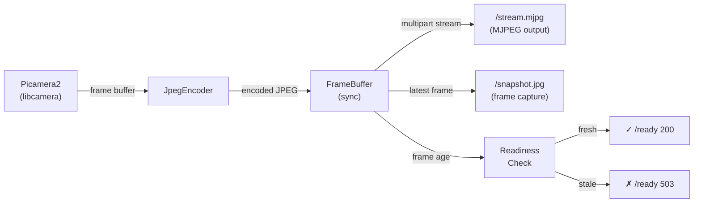

# motion-in-ocean 🌊📷

**Raspberry Pi CSI Camera Streaming in Docker (Picamera2 / libcamera)**

[](LICENSE)
[](https://github.com/CyanAutomation/motioninocean/actions/workflows/ci.yaml)
[](https://github.com/CyanAutomation/motioninocean/actions/workflows/security-scan.yaml)
[](https://github.com/CyanAutomation/motioninocean/pkgs/container/motioninocean)
[](https://www.python.org/downloads/)
[](https://github.com/astral-sh/ruff)
[](#project-status)

motion-in-ocean is a **Docker-first** project for running a **Raspberry Pi CSI camera** inside a container and streaming video across the network. It’s intended for **Raspberry Pi homelabs** and remote Docker hosts, where you want a reliable camera stream without installing a full stack directly on the host OS.

---

## Product Requirements

For product requirements, see the split PRDs:

- [PRD-backend.md](PRD-backend.md) (camera capture, Docker/deployment, health/readiness, metrics)
- [PRD-frontend.md](PRD-frontend.md) (web UI, stream viewing, controls, UX behavior)

---

## Quick Start (Recommended)

> ✅ **Target:** Raspberry Pi OS (64-bit) / Debian Bookworm on ARM64  
> ✅ **Assumption:** CSI camera enabled and working on the host  
> ✅ **Usage:** Homelab LAN / VLAN only (do not expose directly to the internet)

### 1) Create folder + config

Copy `.env.example` to `.env` and edit it for your environment.

```bash
mkdir -p ~/containers/motion-in-ocean
cd ~/containers/motion-in-ocean

curl -fsSL https://raw.githubusercontent.com/<your-org-or-user>/motion-in-ocean/main/.env.example -o .env.example
cp .env.example .env
nano .env
```

> Tip: If you cloned this repo, you can run `./setup.sh` for a guided setup that copies `.env`, optionally runs `./detect-devices.sh`, prompts for `webcam`/`management` profile selection (or both), and prints the exact `docker compose --profile ... up -d` command to run.

### 2) Create `docker-compose.yaml`

```yaml
services:
  motion-in-ocean-webcam:
    image: ghcr.io/cyanautomation/motioninocean:latest
    container_name: motion-in-ocean
    restart: unless-stopped
    profiles: ["webcam"]

    ports:
      - "127.0.0.1:8000:8000" # localhost only (recommended)

    devices:
      - /dev/dma_heap:/dev/dma_heap
      - /dev/vchiq:/dev/vchiq
      # Add your /dev/video* and /dev/media* mappings based on your Pi hardware
      # Tip: use ./detect-devices.sh to identify devices reliably

    env_file:
      - .env

    volumes:
      - /run/udev:/run/udev:ro

    healthcheck:
      test: ["CMD", "python3", "/app/healthcheck.py"]
      interval: 30s
      timeout: 5s
      retries: 3

  motion-in-ocean-management:
    image: ghcr.io/cyanautomation/motioninocean:latest
    container_name: motion-in-ocean-management
    restart: unless-stopped
    profiles: ["management"]

    ports:
      - "127.0.0.1:8001:8000" # separate localhost port for management

    env_file:
      - .env

    # Optional when Docker API discovery/control is enabled:
    # volumes:
    #   - /var/run/docker.sock:/var/run/docker.sock:ro

    healthcheck:
      test: ["CMD", "python3", "/app/healthcheck.py"]
      interval: 30s
      timeout: 5s
      retries: 3
```

### 3) Run it

```bash
docker compose --profile webcam up -d
docker logs -f --timestamps motion-in-ocean
```

For management/control-plane deployments (no camera devices mounted):

```bash
docker compose --profile management up -d
docker logs -f --timestamps motion-in-ocean-management
```

If you browse to your host IP and get no response, set `MOTION_IN_OCEAN_BIND_HOST=0.0.0.0` in `.env` and recreate containers.

```bash
# webcam profile
docker compose --profile webcam up -d --force-recreate

# management profile
docker compose --profile management up -d --force-recreate
```

⚠️ `0.0.0.0` should only be used on trusted networks.

Request logging is enabled in both app modes. Each request emits a compact line with method, path, status, and latency in milliseconds (for example: `request method=GET path=/metrics status=200 latency_ms=1.2`). To reduce noise in `docker logs`, `/health` and `/ready` are logged at `DEBUG`, while all other endpoints remain at `INFO`.

### 4) Check health

```bash
curl http://localhost:8000/health
curl http://localhost:8000/ready
# management profile (default port)
curl http://localhost:8001/health
```

---

## What this project is (and isn’t)

### ✅ What it is

- A lightweight container image that uses:
  - **Picamera2**
  - **libcamera**
  - Raspberry Pi OS Bookworm compatible packages

- Runs on Raspberry Pi 3/4/5 (ARM64) with CSI camera enabled
- Exposes an HTTP endpoint that provides camera streaming / frames
- Includes docker-compose examples for use on remote host deployment patterns

### ❌ What it isn’t

- Not “Motion” (classic Motion daemon / motion.conf workflow)
- Not OctoPrint camera streaming (though it can be consumed by it)
- Not a full NVR / motion detection system (it’s a stream provider)

If you want motion detection / recording, use this project as a camera stream input to another service, or extend it.

---

## Why motion-in-ocean exists

Running the Pi camera inside Docker is harder than USB webcams because the modern Raspberry Pi camera stack is built around **libcamera**, which relies on device discovery via udev and access to host hardware devices.

Many popular Docker camera images:

- don’t ship ARM64 builds
- assume a traditional V4L2 webcam interface
- require host-installed wrappers (e.g. `libcamerify`)

motion-in-ocean solves this by building a container that installs and runs Picamera2 directly on top of Bookworm-compatible Raspberry Pi repositories.

---

## Project Status

This project is small and intentionally focused:

- ✅ solid “homelab” deployment baseline
- ✅ health endpoints
- ✅ Pi camera stack aligned with Bookworm
- 🔄 still evolving device detection, CI/CD and packaging polish

---

## Configuration

Create/edit `.env`:

```env
MOTION_IN_OCEAN_RESOLUTION=640x480
MOTION_IN_OCEAN_FPS=30
MOTION_IN_OCEAN_TARGET_FPS=30
MOTION_IN_OCEAN_JPEG_QUALITY=100
MOTION_IN_OCEAN_MAX_STREAM_CONNECTIONS=10
MOTION_IN_OCEAN_OCTOPRINT_COMPATIBILITY=false
MOTION_IN_OCEAN_PI3_PROFILE=false
MOTION_IN_OCEAN_CORS_ORIGINS=*
MOTION_IN_OCEAN_HEALTHCHECK_READY_WEBCAM=true
MOTION_IN_OCEAN_HEALTHCHECK_READY_MANAGEMENT=false
MOTION_IN_OCEAN_WEBCAM_PORT=8000
MOTION_IN_OCEAN_MANAGEMENT_PORT=8001
MOTION_IN_OCEAN_BIND_HOST=127.0.0.1
TZ=Europe/London
MOCK_CAMERA=false

# Multi-host deployment (advanced)
# ENABLE_DOCKER_SOCKET_PROXY=false
# DOCKER_PROXY_PORT=2375
```

### Options

- `MOTION_IN_OCEAN_RESOLUTION` - Camera resolution (e.g., `640x480`, `1280x720`, `1920x1080`). Max `4096x4096`.
- `MOTION_IN_OCEAN_FPS` - Frame rate limit. `0` uses camera default. Maximum recommended: `120`.
- `MOTION_IN_OCEAN_JPEG_QUALITY` - JPEG quality (1-100) for stream images.
- `MOTION_IN_OCEAN_TARGET_FPS` - Output throttle FPS. If unset, it defaults to `FPS`.
- `MOTION_IN_OCEAN_MAX_STREAM_CONNECTIONS` - Maximum simultaneous `/stream.mjpg` clients.
- `MOTION_IN_OCEAN_OCTOPRINT_COMPATIBILITY` - Enables OctoPrint-compatible webcam routes (`/webcam/?action=stream` and `/webcam/?action=snapshot`). Default: `false`.
  - Legacy `OCTOPRINT_COMPATIBILITY` is still accepted at runtime for backward compatibility, but `MOTION_IN_OCEAN_OCTOPRINT_COMPATIBILITY` is the canonical documented variable.
- `MOTION_IN_OCEAN_PI3_PROFILE` - Pi 3 recommended defaults profile. When enabled, it only fills missing values with: `RESOLUTION=640x480`, `FPS=12`, `TARGET_FPS=12`, `JPEG_QUALITY=75`, `MAX_STREAM_CONNECTIONS=3`.
- `MOTION_IN_OCEAN_CORS_ORIGINS` - Comma-separated list of allowed origins for CORS. If unset, defaults to `*` (all origins).
- `MOTION_IN_OCEAN_HEALTHCHECK_READY_WEBCAM` - Healthcheck endpoint selector for webcam mode. Default: `true` (uses `/ready`).
- `MOTION_IN_OCEAN_HEALTHCHECK_READY_MANAGEMENT` - Healthcheck endpoint selector for management mode. Default: `false` (uses `/health`).
- `MOTION_IN_OCEAN_WEBCAM_PORT` - Host port used by the `webcam` profile. Default: `8000`.
- `MOTION_IN_OCEAN_MANAGEMENT_PORT` - Host port used by the `management` profile. Default: `8001` (avoids port conflict when both profiles run together).
- `MOTION_IN_OCEAN_BIND_HOST` - Network interface to bind to (default: `127.0.0.1` for localhost only). Set to `0.0.0.0` to expose to network. **Multi-host deployments only**.
- `DOCKER_PROXY_PORT` - Port for docker-socket-proxy service when `ENABLE_DOCKER_SOCKET_PROXY=true`. Default: `2375`. **Advanced / Docker-native deployments only**.
- `ENABLE_DOCKER_SOCKET_PROXY` - Enable optional docker-socket-proxy service in docker-compose (default: `false`). When `true`, adds a `docker-socket-proxy` container for Docker API access. **Advanced / Docker-native deployments only**.
- `APP_MODE` - Runtime application mode consumed by the container (`webcam` or `management`).
  - In this repository’s Compose profiles it is set explicitly per service to prevent mode/profile mismatches.
  - If you run the image outside these Compose files, set `APP_MODE` directly in your container environment.
- `TZ` - Logging timezone.
- `MOCK_CAMERA` - `true` disables Picamera2 initialisation and streams dummy frames (dev/testing).

### Pi 3 recommended preset

For Raspberry Pi 3, enable profile mode to apply conservative defaults when explicit runtime env vars are absent:

```env
MOTION_IN_OCEAN_PI3_PROFILE=true
# Optional explicit overrides (these win over profile defaults)
MOTION_IN_OCEAN_RESOLUTION=640x480
MOTION_IN_OCEAN_FPS=12
MOTION_IN_OCEAN_TARGET_FPS=12
MOTION_IN_OCEAN_JPEG_QUALITY=75
MOTION_IN_OCEAN_MAX_STREAM_CONNECTIONS=3
```

---

## Local Development (Non-Raspberry Pi)

For development/testing on a non-Raspberry Pi machine (e.g. `amd64` workstation), camera/display functionality won’t work due to hardware dependencies.

Use mock mode:

```env
MOCK_CAMERA=true
```

This allows you to validate:

- Flask server
- `/health` and `/ready`
- routing, config, general structure

---

## Building Custom Images

The Docker image is optimized for minimal size and fast downloads (~255MB).

```bash
# Using Makefile
make docker-build

# Or directly with Docker
DOCKER_BUILDKIT=1 docker build -t motion-in-ocean:latest .
```

### Build Variants

```bash
# Default: with mock camera support (~255MB)
make docker-build

# Production: without mock camera support (~248MB)
make docker-build-prod
```

**Build Arguments:**

- `INCLUDE_MOCK_CAMERA=true|false` - Include Pillow for mock camera testing (~7MB)

---

## Architecture & key concepts

### Runtime model

- **Container** runs Python and Picamera2
- Uses host udev info to discover camera devices
- Requires elevated device access (see security model)

**Frame Capture Pipeline:**



**Figure 1: Frame Capture and Distribution Pipeline**

Picamera2 captures frames in the container, which are JPEG-encoded and stored in a thread-safe FrameBuffer. This single buffer powers the MJPEG stream (`/stream.mjpg`), snapshot endpoint (`/snapshot.jpg`), and readiness probe logic (frame age check against `MAX_FRAME_AGE_SECONDS`). This design ensures all consumers see consistent, non-stale frames without redundant encoding.

### Hardware access requirements

motion-in-ocean uses:

- `/run/udev:/run/udev:ro` mounted into the container
- Explicit device mappings (`/dev/dma_heap`, `/dev/video*`, `/dev/vchiq`, `/dev/media*`)

These settings prioritise **reliability** over strict hardening, which is reasonable for a homelab VLAN — but should not be exposed to the public internet.

---

## Multi-Host Deployment

For local networks with multiple cameras, run **management mode** on one host to coordinate **webcam mode** instances on other hosts:

### Quick Reference

**Webcam Host** (e.g., `192.168.1.101`):

```bash
export MOTION_IN_OCEAN_BIND_HOST=0.0.0.0
docker-compose --profile webcam up -d
```

**Management Host** (e.g., `192.168.1.100`):

```bash
export MOTION_IN_OCEAN_BIND_HOST=0.0.0.0
docker-compose --profile management up -d
```

Then access the management UI at `http://192.168.1.100:8001/management` and add nodes with `base_url: http://192.168.1.101:8000`.

### Hawser-Style Token Handshake

Use a shared token between each remote webcam node and its management node entry:

1. On the **webcam host**, set a token in `.env`:

```bash
MANAGEMENT_AUTH_TOKEN=replace-with-strong-random-token
```

2. Start (or restart) webcam profile on that host.
3. In management UI, set node auth to `bearer` and enter the same token.

This protects webcam control-plane endpoints (`/health`, `/ready`, `/metrics`, `/api/actions/*`) while keeping stream routes unchanged.

Authenticated probe examples (from management host or any trusted client):

```bash
curl -H "Authorization: Bearer <webcam_node_token>" http://192.168.1.101:8000/health
curl -H "Authorization: Bearer <webcam_node_token>" http://192.168.1.101:8000/metrics
```

### Node Auth Format

Management node auth supports only:

- `{"type": "none"}`
- `{"type": "bearer", "token": "<api_token>"}`

Legacy node auth payloads (`auth.type=basic`, `auth.username`, `auth.password`, `auth.encoded`) are deprecated.
Use `scripts/migrate_node_registry_auth.py` to validate and migrate `NODE_REGISTRY_PATH` before upgrading:

```bash
python scripts/migrate_node_registry_auth.py --path "$NODE_REGISTRY_PATH" --dry-run
python scripts/migrate_node_registry_auth.py --path "$NODE_REGISTRY_PATH"
```

### Features

- ✅ HTTP-based remote node discovery
- ✅ Aggregated stream status and health checks
- ✅ Web UI for node management (add/remove/view streams)
- ✅ Built-in SSRF protection

### Advanced Options

For Docker-native environments, use **docker-socket-proxy** for direct Docker API access:

```bash
# Webcam host
export ENABLE_DOCKER_SOCKET_PROXY=true
docker-compose --profile webcam --profile docker-socket-proxy up -d
```

Then add nodes with `transport: "docker"` in management UI (requires bearer token authentication).

**⚠️ See [DEPLOYMENT.md](DEPLOYMENT.md) for detailed setup, troubleshooting, and security best practices.**

---

## Healthchecks

The container exposes two endpoints:

- `/health` - Liveness (returns 200 if service is running)
- `/ready` - Readiness (returns 200 only if camera is initialised and streaming)

The docker-compose healthcheck uses the bundled `healthcheck.py`, which defaults to `/health`.
Switch to readiness checks with:

- `HEALTHCHECK_READY=true` (uses `/ready` instead of `/health`)
  - In this repo, Compose maps profile-scoped `.env` values (`MOTION_IN_OCEAN_HEALTHCHECK_READY_WEBCAM` / `MOTION_IN_OCEAN_HEALTHCHECK_READY_MANAGEMENT`) into container `HEALTHCHECK_READY`.

Recommended by deployment mode:

- `webcam` profile: use readiness checks (`/ready`) so unhealthy camera initialization is detected.
- `management` profile: use liveness checks (`/health`) so readiness does **not** depend on camera frames.

Compose defaults in this repository already follow those recommendations:

- `MOTION_IN_OCEAN_HEALTHCHECK_READY_WEBCAM=true`
- `MOTION_IN_OCEAN_HEALTHCHECK_READY_MANAGEMENT=false`

Override the full URL (takes precedence over `HEALTHCHECK_READY`) with:

- `HEALTHCHECK_URL` (e.g., `http://127.0.0.1:8000/ready`)
- `HEALTHCHECK_TIMEOUT` (seconds, default `5`)

---

## OctoPrint webcam setup

When configuring OctoPrint's webcam URLs, use the values that match your deployment mode.

### Native endpoints (default)

Use motion-in-ocean's direct routes:

- `webcam.stream`: `http://<host>:8000/stream.mjpg`
- `webcam.snapshot`: `http://<host>:8000/snapshot.jpg`

### OctoPrint compatibility endpoints

Use these if you want OctoPrint-style `?action=` routes.

Both `/webcam?action=...` and `/webcam/?action=...` are supported.
For consistency, prefer the canonical trailing-slash form in OctoPrint config:

- `webcam.stream`: `http://<host>:8000/webcam/?action=stream`
- `webcam.snapshot`: `http://<host>:8000/webcam/?action=snapshot`

> Compatibility routes are only available when `MOTION_IN_OCEAN_OCTOPRINT_COMPATIBILITY=true`.

### Troubleshooting checklist

- Confirm the endpoint path is correct (`/stream.mjpg` vs `/webcam/?action=stream`).
- Confirm `webcam.snapshot` is configured (missing snapshot URL can break previews/features).
- Check readiness at `/ready` and ensure it reports ready (`true`) before testing streams.
- Check `MOTION_IN_OCEAN_MAX_STREAM_CONNECTIONS` if additional clients are rejected.
- If you browse to host IP and get no response, set `MOTION_IN_OCEAN_BIND_HOST=0.0.0.0` in `.env` and recreate containers:

  ```bash
  # webcam profile
  docker compose --profile webcam up -d --force-recreate

  # management profile
  docker compose --profile management up -d --force-recreate
  ```

  ⚠️ Use `0.0.0.0` only on trusted networks.

---

## Security Notes

This container requires access to host camera devices.

Recommended approach uses:

- explicit `devices:` mappings (not privileged mode)
- `/run/udev` mount (read-only)
- bind to localhost unless you _explicitly_ need LAN access

### Network recommendations

- ✅ safest: `127.0.0.1:8000:8000`
- ⚠ LAN access: `8000:8000` (trusted networks only)
- ❌ avoid: internet exposure without authentication

If you need remote access, use a reverse proxy (nginx/Caddy/Traefik) with authentication.

### Management mode hardening guidance

When running the `management` profile, treat it as control-plane infrastructure:

- Keep exposure LAN-only (or VPN-only). Do not publish directly to the public internet.
- Require authentication/authorization via bearer tokens for remote access (see DEPLOYMENT.md).
- Mount `/var/run/docker.sock` only when Docker discovery/control features are explicitly enabled.
  - Prefer read-only mounting where possible.
  - Restrict host-level socket access to trusted administrators.

---

## Technology Stack Verification (2026)

This project uses the **official modern Raspberry Pi camera stack**:

- **libcamera**
- **python3-libcamera**
- **Picamera2**
- **Debian Bookworm**
- **Python 3.11+**
- **libcap-dev** (required for python-prctl)

### Deprecated stack (not supported)

- ❌ picamera (v1.x)
- ❌ raspistill/raspivid
- ❌ MMAL

### Verification

```bash
rpicam-hello --version   # Should work on Bookworm
raspistill --help        # Command not found on Bookworm
```

**References**

- Picamera2 Manual (PDF): [https://datasheets.raspberrypi.com/camera/picamera2-manual.pdf](https://datasheets.raspberrypi.com/camera/picamera2-manual.pdf)
- Camera Software Docs: [https://www.raspberrypi.com/documentation/computers/camera_software.html](https://www.raspberrypi.com/documentation/computers/camera_software.html)
- libcamera Project: [https://libcamera.org/](https://libcamera.org/)

---

## CI / CD

**Automated release process:**

Releases are **tag-driven** and fully automated:

1. Run `./create-release.sh` to create a new version
2. Script updates VERSION and CHANGELOG, commits, and pushes git tag
3. GitHub Actions automatically:
   - Builds Docker image for ARM64
   - Publishes to GHCR with version tags (`:vX.Y.Z`, `:X.Y.Z`, `:X.Y`, `:latest`)
   - Creates GitHub Release with changelog notes
4. Script verifies workflow completion and rolls back if it fails

**Continuous Integration:**

All pull requests and pushes to main/develop branches automatically run:

- **Test Suite** - Python 3.9, 3.11, and 3.12 compatibility tests
- **Linting** - Ruff code quality checks
- **Type Checking** - Mypy static type analysis
- **Security Scanning** - Bandit security checks and Trivy Docker scanning
- **Coverage Reporting** - Test coverage metrics with Codecov integration

**Docker images are published to:**

- `ghcr.io/cyanautomation/motioninocean:latest` (latest release)
- `ghcr.io/cyanautomation/motioninocean:vX.Y.Z` (specific version)
- `ghcr.io/cyanautomation/motioninocean:X.Y.Z` (semantic version)
- `ghcr.io/cyanautomation/motioninocean:X.Y` (major.minor)

**Key guarantees:**

- ✅ Every GitHub release has a corresponding Docker image
- ✅ `latest` tag always points to the newest release
- ✅ Failed builds trigger automatic rollback
- ✅ Release script waits for CI completion before finishing
- ✅ All PRs must pass CI checks before merging

See [RELEASE.md](RELEASE.md) for detailed release process documentation.

---

## Contributing

Contributions are welcome — even small ones like documentation tweaks.

### Quick Start for Contributors

This project now includes modern development tooling:

- **Pre-commit hooks** - Automatic code quality checks before commit
- **Makefile** - Convenient commands for common tasks (`make help`)
- **CI/CD** - Automated testing and linting on all PRs
- **Type checking** - Mypy for Python type safety
- **Security scanning** - Bandit and Trivy for vulnerability detection

**Getting started:**

```bash
# Clone and setup
git clone https://github.com/CyanAutomation/motioninocean.git
cd motioninocean
pip install -r requirements-dev.txt
make pre-commit

# View available commands
make help

# Run quality checks
make lint
make test
make ci
```

### Suggested contribution areas

- Pi device mapping detection improvements
- Compose examples for common homelab consumers (OctoPrint, Home Assistant)
- Prometheus metrics export
- Documentation improvements
- Bug fixes and testing

**See [CONTRIBUTING.md](CONTRIBUTING.md) for detailed guidelines.**

If you’d like to contribute:

1. Fork the repo
2. Create a feature branch
3. Open a PR

---

## Roadmap

Near-term:

- [x] GitHub Actions workflow for ARM64 builds to GHCR
- [x] Release tagging + Changelog automation
- [x] Automated GitHub Release creation
- [x] Pre-commit hooks for code quality
- [x] CI/CD pipeline (testing, linting, type checking)
- [x] Security scanning (Bandit, Trivy)
- [x] Dependabot for automated dependency updates
- [x] Multi-arch builds (ARM64 + AMD64 support)
- [ ] Home Assistant / OctoPrint examples
- [ ] Improve device mapping auto-detection tooling
- [ ] Prometheus metrics endpoint enhancements

---

## Support / Debugging

### Cannot reach UI

Run these checks in order:

1. Check the container exists and is running for the profile you intended.

   ```bash
   docker compose ps
   ```

2. Confirm you started the correct app profile.

   ```bash
   # webcam UI/stream host
   docker compose --profile webcam up -d

   # management UI host
   docker compose --profile management up -d
   ```

3. Verify port bindings include the expected host interface and port.

   ```bash
   docker compose ps
   ```

   - `127.0.0.1:8000->8000/tcp` = localhost only
   - `0.0.0.0:8000->8000/tcp` = reachable via host IP/LAN

4. Map symptoms to likely causes and fixes.

   - **No container for the service in `docker compose ps`** → likely missing profile.

     ```bash
     # start the missing profile
     docker compose --profile webcam up -d
     # or
     docker compose --profile management up -d
     ```

   - **Binding is `127.0.0.1` but you access via host IP** → service only listens on localhost.

     ```bash
     # update your compose ports from 127.0.0.1:PORT:8000 to 0.0.0.0:PORT:8000 (or PORT:8000)
     # then recreate
     docker compose up -d
     ```

Common commands:

```bash
docker compose ps
docker compose logs -f
docker exec -it motion-in-ocean sh

ls -l /dev/video*
ls -l /dev/dma_heap
```

If something doesn’t work, open an issue and include:

- Pi model + OS version (Bookworm?)
- camera module type
- compose file snippet (devices/volumes)
- container logs
- output of `/health` and `/ready`

---

## License

This project should include a LICENSE file.

Until then: treat it as “all rights reserved”.

---

## Acknowledgements

This repo is a fork of `hyzhak/pi-camera-in-docker`, with a focus on making the concept more production-ready for homelab use.

---

## Links

- License section: [LICENSE](LICENSE.md)
- Contributing section: [CONTRIBUTING](CONTRIBUTING.md)
- Security section: [SECURITY](SECURITY.md)
- Code of Conduct: [CODE_OF_CONDUCT](CODE_OF_CONDUCT.md)
