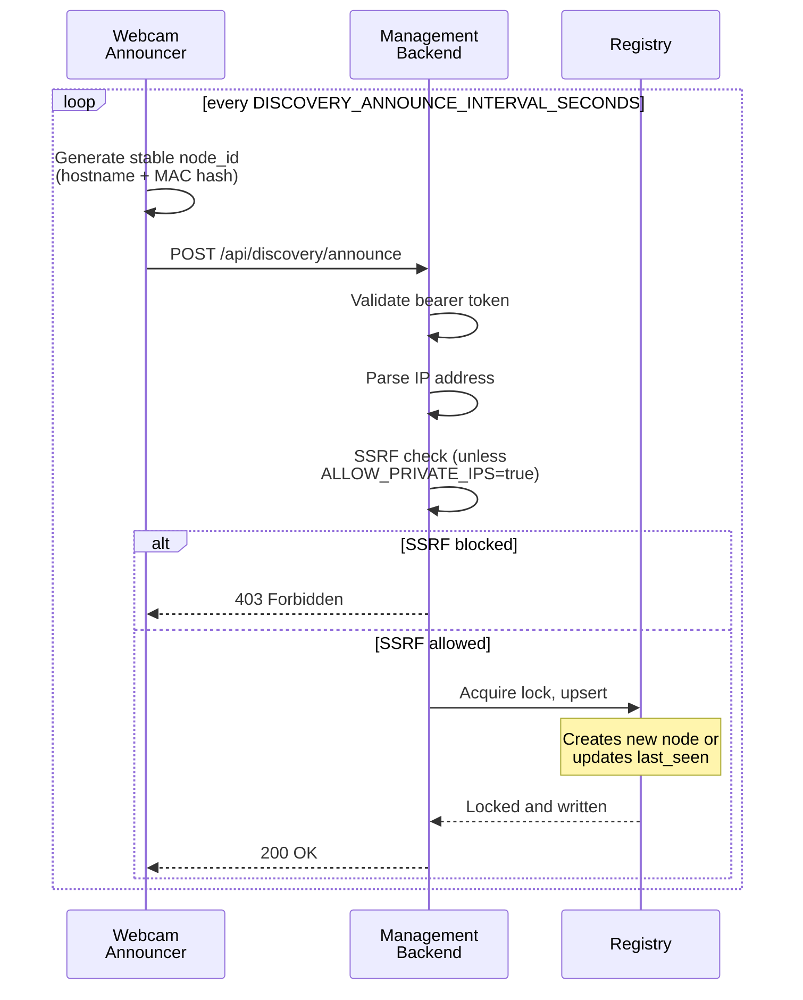

# PRD (Backend): motion-in-ocean

## Scope

This document contains backend-specific requirements only. For shared problem statement,
cross-cutting goals, and shared constraints/non-goals, see [PRD-core.md](PRD-core.md).

## Backend Requirements

### Multi-Host Architecture Overview

```mermaid
graph LR
    subgraph "Cameras"
        WC1["Webcam Host 1<br/>(APP_MODE=webcam)"]
        WC2["Webcam Host 2<br/>(APP_MODE=webcam)"]
    end
    subgraph "Management"
        MGMT["Management Host<br/>(APP_MODE=management)"]
    end
    subgraph "Persistence"
        REG["Node Registry<br/>(JSON file)"]
    end
    subgraph "User"
        BR["Browser"]
    end

    WC1 -->|POST /api/discovery/announce| MGMT
    WC2 -->|POST /api/discovery/announce| MGMT
    MGMT -->|Upserts| REG
    BR -->|GET /nodes<br/>POST /nodes/{id}| MGMT
    MGMT -->|Management aggregation contract:<br/>GET /api/status (required)| WC1
    MGMT -->|Management aggregation contract:<br/>GET /api/status (required)| WC2
    MGMT -.->|Operator diagnostics only:<br/>GET /health, /ready, /metrics| WC1
    MGMT -.->|Operator diagnostics only:<br/>GET /health, /ready, /metrics| WC2
```

**Key flows:**

- Webcams announce themselves to management (discovery)
- Management status aggregation contract probes `GET /api/status` on each approved node
- `/health`, `/ready`, and `/metrics` are operator-facing diagnostics and are not part of management health classification
- Registry persists node metadata with atomic file locking

---

### 1. MJPEG Streaming Endpoint (P1)

**Endpoint:** `GET /stream.mjpg`

**Behavior:**

- Streams multipart MJPEG frames with `boundary=frame`.
- Returns HTTP `503` if backend is not ready to serve frames.
- Sends cache-control headers to avoid stale stream caching.

#### Streaming Pipeline


**Concurrency details:**

- Frame writes use `Condition` to efficiently notify waiting readers
- Stats snapshot holds `Lock` only long enough to read counters
- FPS calculated from rolling 30-frame window (monotonic timestamps)
- Optional frame throttling via `_target_frame_interval`
- Connection limit enforced via `ConnectionTracker`
- Oversized frames dropped if `> MAX_FRAME_SIZE`

### 2. Health & Readiness Probes (P1)

**Endpoints:**

- `GET /health` → liveness endpoint; returns `200` when server process is up.
- `GET /ready` → readiness endpoint; returns `200` only when recording has started and frame freshness is within threshold.

**Readiness details:**

- Returns `503` with diagnostic reason when:
  - recording has not started,
  - no frame has been captured,
  - or frame age exceeds `MAX_FRAME_AGE_SECONDS`.

### 3. Raspberry Pi CSI Camera Capture (P1)

- Uses Picamera2/libcamera for headless capture.
- Supports configured FPS limiting when enabled.
- Starts/stops recording cleanly across process lifecycle.

### 4. Environment-Driven Configuration (P1)

- `RESOLUTION` (default `640x480`, max `4096x4096`)
- `FPS` (default `0`, max `120`)
- `JPEG_QUALITY` (default `100`)
- `CORS_ORIGINS` (default `*` unless configured)
- `MOCK_CAMERA` (default `false`)
- `MAX_FRAME_AGE_SECONDS` (default `10`)

Invalid values must fall back to safe defaults.

### 5. Metrics Endpoint (P2)

**Endpoint:** `GET /metrics`

Returns JSON for lightweight observability (uptime, FPS, frame counters, frame age, configured resolution, timestamp).

### 6. Mock Camera Mode (P3)

When `MOCK_CAMERA=true`, backend skips CSI initialization and emits synthetic JPEG frames for local/test validation.

## Backend API Requirements (Management Mode)

When `APP_MODE=management`, backend exposes control-plane APIs.

### Security: SSRF Protection


**Configuration:**

- Default: `MOTION_IN_OCEAN_ALLOW_PRIVATE_IPS=false` (production-safe)
- For LANs: Set to `true`
- Bearer token in `Authorization: Bearer <token>` header
- Error codes: `SSRF_BLOCKED`, `NODE_UNAUTHORIZED`, `NODE_UNREACHABLE`

---

### Node Registry Model

Node schema fields:

- `id` (required, unique)
- `name` (required)
- `base_url` (required, `http://` or `https://`)
- `auth` (required; `{ "type": "none" }` or `{ "type": "bearer", "token": "..." }`)
- `labels` (required object)
- `last_seen` (required ISO timestamp)
- `capabilities` (required string array)
- `transport` (required: `http` or `docker`)

Persistence uses registry abstraction (initially file-backed via `NODE_REGISTRY_PATH`).

#### Node Discovery Lifecycle


**Atomicity:** Registry lock ensures concurrent announcements from multiple webcams are serialized.

#### Discovery Sequence Flow



**Resilience:** Announcements repeat (not one-shot); failures are retried on next cycle.

### Endpoints

- `GET /api/nodes`
- `POST /api/nodes`
- `GET /api/nodes/{id}`
- `PUT /api/nodes/{id}`
- `DELETE /api/nodes/{id}`
- `GET /api/nodes/{id}/status`
- `POST /api/nodes/{id}/actions/{action}`
- `GET /api/management/overview`

#### Management Status Aggregation


**Status Aggregation Flowchart:**


**Performance note:** Queries execute in parallel with per-node timeout to prevent slow aggregation.

### Error Schema

```json
{
  "error": {
    "code": "VALIDATION_ERROR|NODE_NOT_FOUND|NODE_UNREACHABLE|NODE_UNAUTHORIZED|TRANSPORT_UNSUPPORTED",
    "message": "human-readable message",
    "node_id": "optional-node-id",
    "details": {},
    "timestamp": "ISO-8601 timestamp"
  }
}
```

### API Test Mode (Deterministic Status Validation)

Webcam mode supports deterministic status simulation for management validation.

#### Environment Variables

- `API_TEST_MODE_ENABLED` (`true|false`, default `false`)
- `API_TEST_CYCLE_INTERVAL_SECONDS` (positive float, default `5`)
- `MANAGEMENT_AUTH_TOKEN` (required when protecting `/api/status` and `/api/actions/*`)

#### Webcam Action Endpoints

- `POST /api/actions/api-test-start`
  - Optional body: `{ "interval_seconds": <positive number>, "scenario_order": [0,1,2] }`
  - Starts deterministic transitions.
- `POST /api/actions/api-test-stop`
  - Body: `{}`
  - Stops automatic transitions (state remains fixed).
- `POST /api/actions/api-test-step`
  - Body: `{}`
  - Advances exactly one deterministic state; stays paused.
- `POST /api/actions/api-test-reset`
  - Body: `{}`
  - Resets to state index `0`; stays paused.

#### Management Passthrough Endpoint

- `POST /api/nodes/{id}/actions/{action}`
  - Forwards to node `POST /api/actions/{action}` with same JSON body.
  - Returns `{ node_id, action, status_code, response }`.

#### Expected Default Scenario Sequence

1. `ok`: `stream_available=true`, `camera_active=true`, `fps=24.0`
2. `degraded`: `stream_available=false`, `camera_active=true`, `fps=0.0`
3. `degraded`: `stream_available=false`, `camera_active=false`, `fps=0.0`

#### Operator Checklist

- [ ] Confirm all three deterministic states appear in management UI/API.
- [ ] Confirm interval-driven transition advances state index.
- [ ] Confirm `api-test-step` changes state immediately and pauses.
- [ ] Confirm `api-test-stop` keeps current state fixed.
- [ ] Confirm `api-test-reset` restores state index `0`.
- [ ] Confirm protected action routes still require valid bearer auth.

## Backend Acceptance Criteria

- [ ] `/health` returns `200` with healthy liveness payload whenever process is running.
- [ ] `/ready` returns `200` only for active + fresh frame state; otherwise `503` with reason.
- [ ] `/stream.mjpg` serves valid MJPEG multipart stream or `503` when not ready.
- [ ] `/metrics` returns JSON with runtime counters and configuration-facing values.
- [ ] Environment variable validation applies safe defaults for invalid inputs.
- [ ] `MOCK_CAMERA=true` supports hardware-free startup and endpoint behavior.
- [ ] Management endpoints enforce node schema and return standardized errors.
