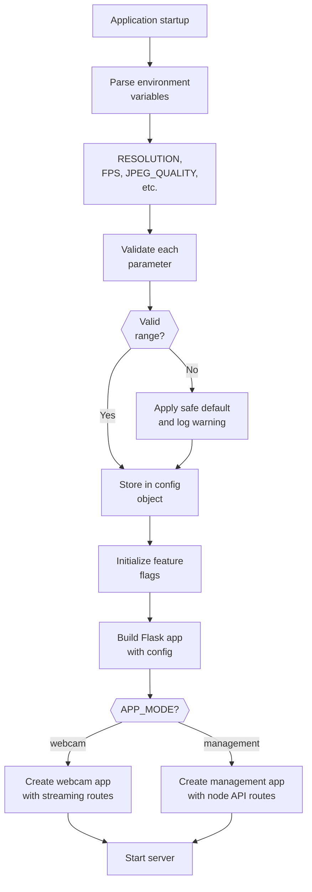
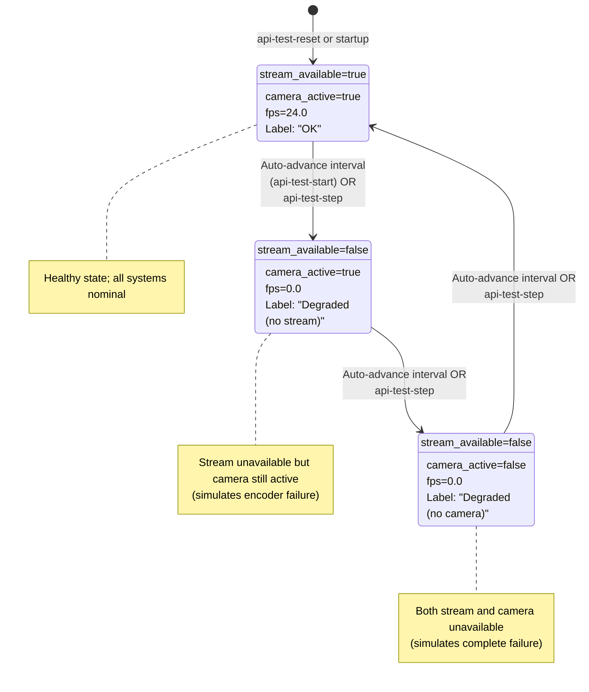

# PRD Core: motion-in-ocean

## Purpose

This document captures shared product context used by both backend and frontend PRDs. Domain-specific requirements live in:

- [PRD-backend.md](PRD-backend.md)
- [PRD-frontend.md](PRD-frontend.md)

## Problem Statement

Running a Raspberry Pi CSI camera in a Dockerized homelab setup is operationally complex.
Users need a system that is easy to deploy, provides reliable live-stream visibility,
and communicates health/readiness clearly so failures can be detected and recovered quickly.

## Cross-Cutting Goals

- **Reliable end-to-end streaming:** The system provides a usable live camera experience when camera hardware is available.
- **Clear service state semantics:** Liveness and readiness are understandable to both operators and UI users.
- **Low-friction deployment and operation:** Setup, upgrades, and diagnostics are straightforward for homelab operators.
- **Observable behavior:** Status and runtime signals are exposed in machine-readable and human-readable form.
- **Resilient user experience:** Temporary failures are surfaced clearly and recover without manual intervention where possible.

## Shared Constraints

- Primary deployment target is Raspberry Pi + CSI camera in Docker.
- Solution should work in headless environments and local/LAN-first topologies.
- Runtime behavior is environment-driven/configurable rather than hard-coded.
- Stream and status endpoints must degrade gracefully when camera/device dependencies are unavailable.

## Configuration & Startup

### Configuration Validation Pipeline



**Validation functions:**

- `validate_resolution()`: WIDTHxHEIGHT format, max 4096x4096
- `validate_integer_range()`: Min/max bounds checking
- `validate_all_config()`: Preflighting at startup
- Feature flags bootstrapped from env vars (DISCOVERY_ENABLED, etc.)

---

## Concurrency & Atomicity

### Concurrent Node Registry Operations

```mermaid
sequenceDiagram
    participant Webcam1 as Webcam 1<br/>Announcer
    participant Webcam2 as Webcam 2<br/>Announcer
    participant Mgmt as Management<br/>Backend
    participant Lock as File Lock
    participant Reg as Registry File

    par Simultaneous announcements
        Webcam1->>Mgmt: POST /announce (to node A)
    and
        Webcam2->>Mgmt: POST /announce (to node B)
    end

    Mgmt->>Mgmt: Both requests<br/>begin upsert logic

    Mgmt->>Lock: Webcam1 requests lock
    Mgmt->>Lock: Webcam2 requests lock

    Lock->>Lock: Serialize: Webcam1 first
    Lock-->>Webcam1: Lock acquired

    Webcam1->>Reg: Read registry
    Webcam1->>Reg: Find/create node A
    Webcam1->>Reg: Write updated registry

    Webcam1->>Lock: Release lock
    Lock-->>Webcam2: Lock acquired

    Webcam2->>Reg: Read registry<br/>(includes node A)
    Webcam2->>Reg: Find/create node B
    Webcam2->>Reg: Write updated registry

    Webcam2->>Lock: Release lock

    note over Lock
        Atomic file locking (fcntl on POSIX, msvcrt on Windows)
        ensures registry consistency under concurrent updates
    end note
```

**Atomicity guarantees:**

- Read-modify-write serialized via file lock
- Multiple concurrent nodes cannot corrupt registry
- Last writer wins (expected behavior for discovery)
- `last_seen` timestamp updated on each announce

---

## Testing & Observability

### API Test Mode State Machine



**Control actions:**

- `POST /api/actions/api-test-start`: Begin auto-transitions at `API_TEST_CYCLE_INTERVAL_SECONDS` (default 5s)
- `POST /api/actions/api-test-step`: Advance exactly one state (manual), then pause
- `POST /api/actions/api-test-stop`: Freeze current state (no more transitions)
- `POST /api/actions/api-test-reset`: Return to State 0 (always paused after reset)

**Atomic transitions:** Concurrent requests to different action endpoints must not race; state advancement is atomic per HTTP request.

---

## Shared Non-Goals

- Internet-hardened production platform (e.g., full zero-trust posture,

  enterprise IAM).

- Multi-protocol media platform beyond current scoped transports (e.g., full HLS/RTSP suite by default).
- Heavy orchestration dependencies for baseline single-node use.
- Rich media management workflows (recording library, editing, archival pipeline).
