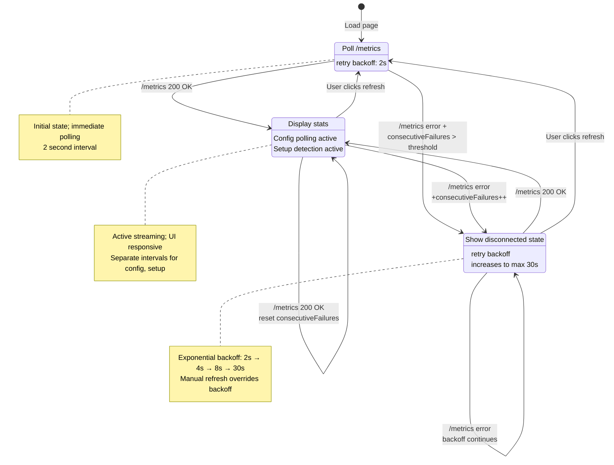
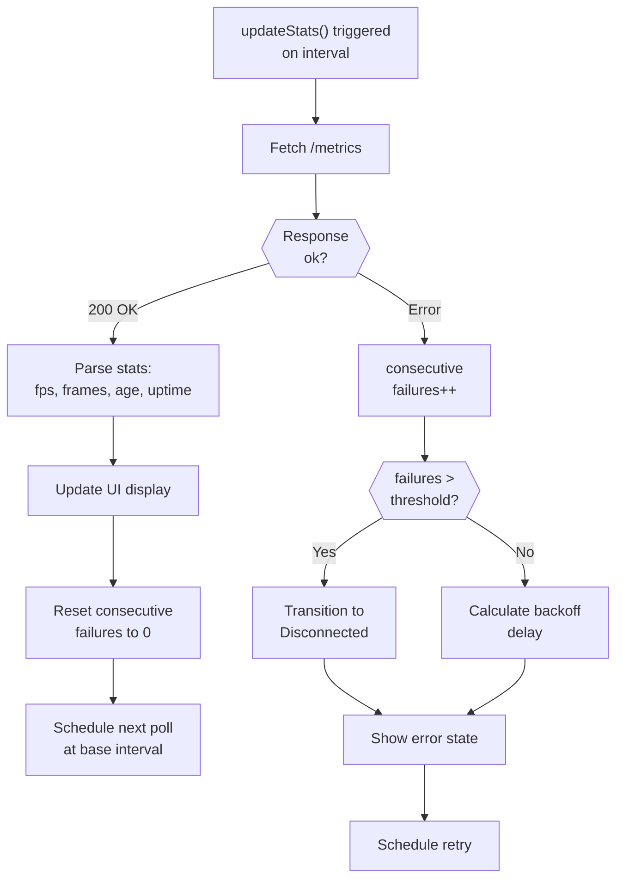
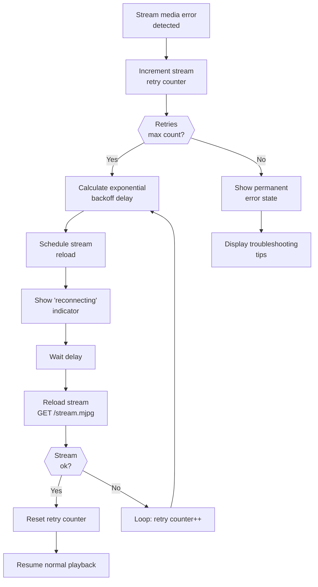
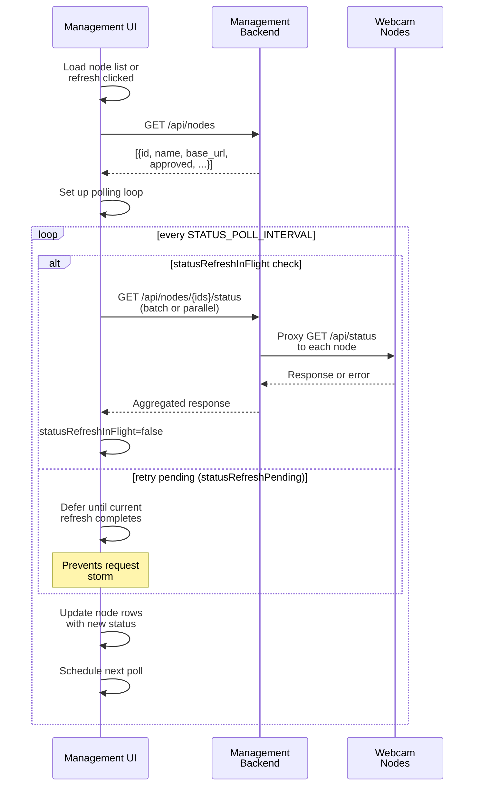
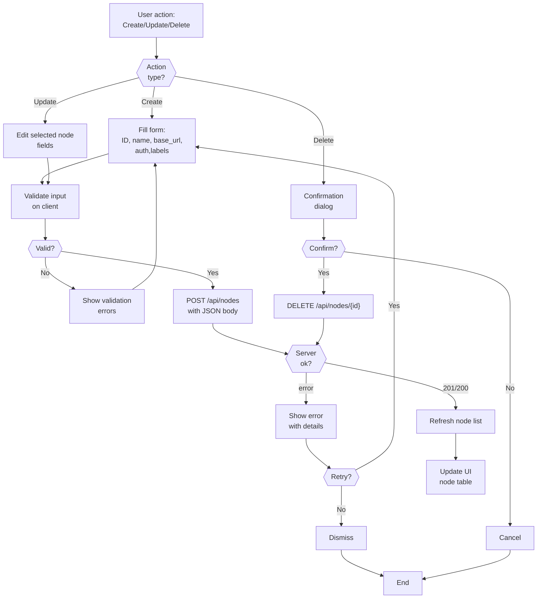

# PRD (Frontend): motion-in-ocean

## Scope

This document contains frontend-specific requirements only. For shared problem statement, cross-cutting goals, and shared constraints/non-goals, see [PRD-core.md](PRD-core.md).

## Frontend Requirements

### 1. Stream Viewer UI (P1)

**Endpoint:** `GET /`

- Renders live MJPEG stream in responsive layout.
- Exposes connection status indicator.
- Provides refresh and fullscreen controls.

#### Webcam Viewer State Machine

**Polling intervals:**
- Stats refresh: 2-30s (exponential backoff on failure)
- Config polling: 5s (independent)
- Setup detection: 5s (independent, during idle)

### 2. Status & Stats Presentation (P2)

- Polls backend readiness/status data on interval.
- Shows user-facing state transitions (e.g., Connecting, Connected, Disconnected).
- Displays stream stats such as FPS, frame count, uptime, and resolution.
- Keeps stats panel usable on small screens.

#### Webcam UI Stats Polling

**Config & setup polling are independent:**
- Config polling: `/api/config` every 5s (resolution, FPS, JPEG quality changes)
- Setup detection: Device discovery endpoint every 5s (during setup tab)
- All three polling streams use shared `updateInterval` but separate timers

### 3. Resilience & Retry Behavior (P2)

- Retries failed status polling with backoff.
- Retries stream reload on media errors with independent backoff policy.
- Surfaces degraded state without blocking later automatic recovery.

#### Stream Reload Retry Logic

**Backoff policy:** 2s, 4s, 8s, 16s, 30s (exponential, max 30s)
**Stream polling:** Independent from stats polling (separate intervals)

---

## Management UI (dashboard.html / management.js)

When accessing `GET /` on management host, displays node management interface.

### Node Management Interface

**Features:**
- Node registration form (manual or discovered)
- Node table with approval/deletion controls
- Status polling for each node (independent)
- Diagnostic panel with remediation hints

#### Management Node Status Polling

**Deduplication logic:**
- `statusRefreshInFlight=true` during fetch
- `statusRefreshPending=true` if new poll requested during fetch
- Next cycle processes pending poll
- Prevents concurrent requests to backend

#### Node CRUD Workflow

---

## Frontend API Dependencies

Frontend integrates with backend APIs:

- `GET /stream.mjpg`
- `GET /ready`
- `GET /metrics` (or readiness payload fields used for stats)

See [PRD-backend.md](PRD-backend.md) for API semantics and payload expectations.

## Frontend Acceptance Criteria

- [ ] UI loads and renders stream on LAN in normal operating conditions.
- [ ] Refresh control reloads stream without full page refresh.
- [ ] Fullscreen control toggles stream view correctly.
- [ ] UI status reflects backend readiness/connection changes.
- [ ] UI displays expected stream stats from backend APIs.
- [ ] Polling failures trigger backoff retry and eventual recovery when backend returns.
- [ ] Stream errors trigger reload attempts with backoff.
